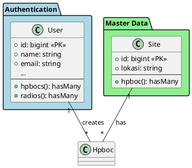
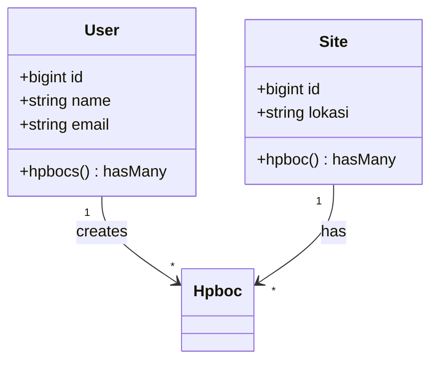

# PROMPT UNTUK AI: BUAT CLASS DIAGRAM PERTAMINA IT DASHBOARD

Saya memiliki project Laravel 12 bernama **Pertamina IT Dashboard** untuk manajemen aset IT. Buatkan Class Diagram lengkap dalam format PlantUML atau Mermaid dengan detail berikut:

---

## 📋 INFORMASI PROJECT

**Nama**: Pertamina IT Dashboard  
**Framework**: Laravel 12 + React 19 + Inertia.js 2.0  
**Database**: SQLite/MySQL  
**Bahasa**: PHP 8.2+

---

## 🗂️ DAFTAR MODEL & RELATIONSHIPS

### 1. **User** (Authentication)
**Table**: `users`

**Attributes:**
- `id`: bigint (PK)
- `name`: string
- `email`: string (unique)
- `email_verified_at`: timestamp (nullable)
- `password`: string (hashed)
- `remember_token`: string (nullable)
- `created_at`: timestamp
- `updated_at`: timestamp

**Relationships:**
- **hasMany** → Hpboc (created_by)
- **hasMany** → Hpboc (updated_by)
- **hasMany** → Radio (created_by)
- **hasMany** → Radio (updated_by)
- **hasMany** → Telephone (created_by)
- **hasMany** → Telephone (updated_by)
- **hasMany** → PcDevice (created_by)
- **hasMany** → PcDevice (updated_by)
- **hasMany** → NetworkDevice (created_by)
- **hasMany** → NetworkDevice (updated_by)
- **hasMany** → Cctv (created_by)
- **hasMany** → Cctv (updated_by)
- **hasMany** → Ticket (created_by)
- **hasMany** → Ticket (updated_by)

**Methods:**
- `creator()`: belongsTo(User, 'created_by')
- `updater()`: belongsTo(User, 'updated_by')

---

### 2. **Site** (Lokasi Pertamina)
**Table**: `sites`

**Attributes:**
- `id`: bigint (PK)
- `lokasi`: string (nama site)
- `created_at`: timestamp
- `updated_at`: timestamp

**Relationships:**
- **hasMany** → Hpboc
- **hasMany** → Radio
- **hasMany** → Telephone

**Methods:**
- `hpboc()`: hasMany(Hpboc)
- `radios()`: hasMany(Radio)
- `telephones()`: hasMany(Telephone)

**Data**: 15 lokasi Pertamina (MPS, SM5, TBBM Plaju, Sungai Gerong, dll.)

---

### 3. **Hpboc** (HP/BOC Devices)
**Table**: `hpboc`

**Attributes:**
- `id`: bigint (PK)
- `nama_perangkat`: string
- `jumlah`: integer
- `tanggal_pencatatan`: date
- `status`: enum('rusak', 'baik', 'maintenance')
- `site_id`: bigint (FK → sites.id)
- `created_by`: bigint (FK → users.id, nullable)
- `updated_by`: bigint (FK → users.id, nullable)
- `created_at`: timestamp
- `updated_at`: timestamp

**Relationships:**
- **belongsTo** → Site
- **belongsTo** → User (creator)
- **belongsTo** → User (updater)

**Methods:**
- `site()`: belongsTo(Site)
- `creator()`: belongsTo(User, 'created_by')
- `updater()`: belongsTo(User, 'updated_by')

**Traits:** HasFactory

---

### 4. **Radio** (Radio HT/Handy Talky)
**Table**: `radio`

**Attributes:**
- `id`: bigint (PK)
- `nama_perangkat`: string
- `jumlah`: integer
- `tanggal_pencatatan`: date
- `status`: enum('on', 'off', 'maintenance')
- `site_id`: bigint (FK → sites.id)
- `created_by`: bigint (FK → users.id, nullable)
- `updated_by`: bigint (FK → users.id, nullable)
- `created_at`: timestamp
- `updated_at`: timestamp

**Relationships:**
- **belongsTo** → Site
- **belongsTo** → User (creator)
- **belongsTo** → User (updater)

**Methods:**
- `site()`: belongsTo(Site)
- `creator()`: belongsTo(User, 'created_by')
- `updater()`: belongsTo(User, 'updated_by')

**Traits:** HasFactory

---

### 5. **Telephone** (Telepon Kantor)
**Table**: `telephone`

**Attributes:**
- `id`: bigint (PK)
- `nama_pic`: string (Person In Charge - UNIQUE: bukan nama perangkat!)
- `jumlah`: integer
- `tanggal_pencatatan`: date
- `status`: enum('on', 'off', 'maintenance')
- `site_id`: bigint (FK → sites.id)
- `created_by`: bigint (FK → users.id, nullable)
- `updated_by`: bigint (FK → users.id, nullable)
- `created_at`: timestamp
- `updated_at`: timestamp

**Relationships:**
- **belongsTo** → Site
- **belongsTo** → User (creator)
- **belongsTo** → User (updater)

**Methods:**
- `site()`: belongsTo(Site)
- `creator()`: belongsTo(User, 'created_by')
- `updater()`: belongsTo(User, 'updated_by')

**Traits:** HasFactory

**Note Khusus**: nama_pic menyimpan nama orang (PIC), bukan nama perangkat!

---

### 6. **PcDevice** (Desktop, Notebook, Printer)
**Table**: `pcdevice`

**Attributes:**
- `id`: bigint (PK)
- `jenis`: enum('desktop', 'notebook', 'printer')
- `nama_perangkat`: string
- `jumlah`: integer
- `tanggal_pencatatan`: date
- `alokasi`: enum('MPS', 'SM5')
- `created_by`: bigint (FK → users.id, nullable)
- `updated_by`: bigint (FK → users.id, nullable)
- `created_at`: timestamp
- `updated_at`: timestamp

**Relationships:**
- **belongsTo** → User (creator)
- **belongsTo** → User (updater)

**Methods:**
- `creator()`: belongsTo(User, 'created_by')
- `updater()`: belongsTo(User, 'updated_by')

**Traits:** HasFactory

**Note**: Tidak ada relasi ke Site, langsung ke alokasi (MPS/SM5)

---

### 7. **NetworkDevice** (Router, Switch, Access Point)
**Table**: `networkdevice`

**Attributes:**
- `id`: bigint (PK)
- `nama_perangkat`: string
- `ip_address`: string (nullable)
- `tanggal_pencatatan`: date
- `jenis`: enum('router', 'switch', 'access_point')
- `up`: string (nullable)
- `down`: string (nullable)
- `availability`: string (nullable)
- `created_by`: bigint (FK → users.id, nullable)
- `updated_by`: bigint (FK → users.id, nullable)
- `created_at`: timestamp
- `updated_at`: timestamp

**Relationships:**
- **belongsTo** → User (creator)
- **belongsTo** → User (updater)

**Methods:**
- `creator()`: belongsTo(User, 'created_by')
- `updater()`: belongsTo(User, 'updated_by')

**Traits:** HasFactory

---

### 8. **Cctv** (CCTV Cameras)
**Table**: `cctv`

**Attributes:**
- `id`: bigint (PK)
- `nama_perangkat`: string
- `ip_address`: string (nullable)
- `tanggal_pencatatan`: date
- `kepemilikan`: string (nullable)
- `status`: enum('online', 'offline', 'maintenance')
- `up`: string (nullable) - jumlah kamera aktif
- `down`: string (nullable) - jumlah kamera mati
- `availability`: string (nullable) - persentase availability
- `created_by`: bigint (FK → users.id, nullable)
- `updated_by`: bigint (FK → users.id, nullable)
- `created_at`: timestamp
- `updated_at`: timestamp

**Relationships:**
- **belongsTo** → User (creator)
- **belongsTo** → User (updater)

**Methods:**
- `creator()`: belongsTo(User, 'created_by')
- `updater()`: belongsTo(User, 'updated_by')

**Traits:** HasFactory

---

### 9. **Ticket** (IT Support Tickets)
**Table**: `ticket`

**Attributes:**
- `id`: bigint (PK)
- `customer_fullname`: string
- `assignee_name`: string (nama teknisi)
- `summary`: text
- `tanggal_pencatatan`: date
- `status`: enum('open', 'in_progress', 'closed')
- `created_by`: bigint (FK → users.id, nullable)
- `updated_by`: bigint (FK → users.id, nullable)
- `created_at`: timestamp
- `updated_at`: timestamp

**Relationships:**
- **belongsTo** → User (creator)
- **belongsTo** → User (updater)

**Methods:**
- `creator()`: belongsTo(User, 'created_by')
- `updater()`: belongsTo(User, 'updated_by')

**Traits:** HasFactory

---

## 🎯 REQUIREMENTS CLASS DIAGRAM

Buatkan Class Diagram dengan kriteria berikut:

### 1. **Format**
- Gunakan **PlantUML** atau **Mermaid** syntax
- Lengkap dengan visibility modifiers (+, -, #)
- Sertakan data types untuk semua attributes
- Tampilkan relationships dengan cardinality

### 2. **Detail yang Harus Ada**

**A. Setiap Class harus menampilkan:**
- Class name
- All attributes dengan type dan constraints
- Primary Key (PK) dan Foreign Key (FK)
- Enum values lengkap
- All methods (relationships)
- Traits yang digunakan (HasFactory, Notifiable)

**B. Relationships yang harus digambarkan:**
- User → Multiple Models (creator, updater)
- Site → Hpboc (1:N)
- Site → Radio (1:N)
- Site → Telephone (1:N)
- Semua belongsTo ke User untuk audit trail

**C. Notasi:**
- `1` → One
- `*` atau `0..*` → Many
- `0..1` → Zero or One
- Arrow direction sesuai relationship type

### 3. **Pengelompokan (Packages)**

Kelompokkan model berdasarkan kategori:
- **Authentication**: User
- **Master Data**: Site
- **Asset Management**: Hpboc, Radio, Telephone, PcDevice, NetworkDevice, Cctv
- **Support**: Ticket

### 4. **Styling & Readability**
- Gunakan warna berbeda untuk setiap package
- Font yang jelas dan mudah dibaca
- Atur layout agar tidak overlapping
- Prioritaskan clarity daripada complexity

### 5. **Legend/Keterangan**
Tambahkan legend yang menjelaskan:
- PK = Primary Key
- FK = Foreign Key
- Enum types dan allowed values
- Relationship types (hasMany, belongsTo)

---

## 📐 CONTOH FORMAT OUTPUT

### **PlantUML:**

### **Mermaid:**

---

## ✅ CHECKLIST

Pastikan Class Diagram mencakup:

- [ ] **9 Models** lengkap (User, Site, Hpboc, Radio, Telephone, PcDevice, NetworkDevice, Cctv, Ticket)
- [ ] **Semua attributes** dengan data type yang benar
- [ ] **Primary Keys** dan **Foreign Keys** ditandai jelas
- [ ] **Enum values** ditampilkan lengkap
- [ ] **All relationships** (hasMany, belongsTo) dengan cardinality
- [ ] **Audit trail** relationships (created_by, updated_by ke User)
- [ ] **Package/Grouping** berdasarkan kategori
- [ ] **Legend** untuk penjelasan notasi
- [ ] **Clean layout** tanpa overlapping
- [ ] **Readable font** dan spacing yang baik

---

## 🎨 PREFERENSI VISUAL

- **Tools**: PlantUML (preferred) atau Mermaid
- **Colors**: Gunakan 4 warna berbeda untuk packages
- **Layout**: Top-to-bottom atau Left-to-right
- **Size**: Optimized untuk A4 portrait/landscape
- **Export**: SVG atau PNG high resolution

---

## 📝 CATATAN PENTING

1. **Telephone.nama_pic** adalah UNIQUE - menyimpan nama PIC (Person In Charge), bukan nama perangkat
2. **PcDevice** tidak punya relasi ke Site, langsung ke alokasi enum (MPS/SM5)
3. **Cctv** dan **NetworkDevice** punya field `up`, `down`, `availability` untuk monitoring
4. **Semua model asset** punya `created_by` dan `updated_by` untuk audit trail
5. **Site** hanya berelasi dengan: Hpboc, Radio, Telephone (tidak semua model)

---

## 🚀 OUTPUT YANG DIHARAPKAN

Berikan saya:
1. **Full PlantUML code** yang bisa langsung di-render
2. **Penjelasan singkat** tentang struktur diagram
3. **Saran improvement** jika ada yang bisa ditambahkan

Buatkan Class Diagram yang **profesional**, **lengkap**, dan **mudah dipahami** untuk dokumentasi project ini!
