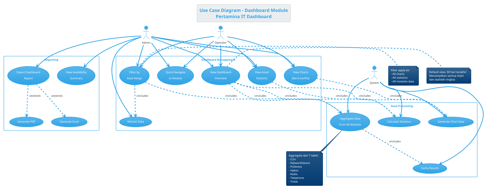
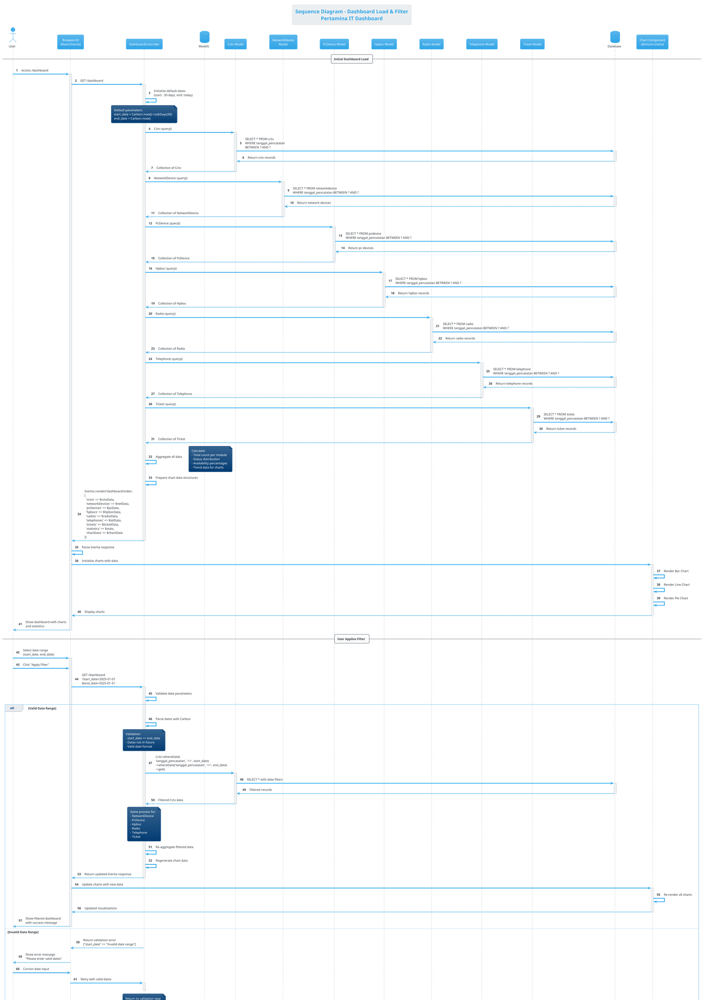

# UML DIAGRAMS - DASHBOARD MODULE

> **Module**: Dashboard  
> **Priority**: HIGH  
> **Complexity**: MEDIUM  
> **Status**: ✅ Ready to Render

---

## 📋 MODULE INFORMATION

**Description**: Dashboard adalah halaman utama yang menampilkan overview semua aset IT dalam bentuk visualisasi chart, statistik ringkas, dan quick access ke modul lain.

**Key Features**:
- Visualisasi data dengan charts (Bar, Line, Pie)
- Summary statistics per kategori perangkat
- Filter berdasarkan periode (date range)
- Quick links ke setiap modul
- Real-time count perangkat

**Actors**:
- **Admin**: Full access ke dashboard dan filter
- **Operator**: View-only dashboard
- **System**: Generate data aggregation

**Business Rules**:
- Data aggregated dari semua tabel asset (Cctv, NetworkDevice, PcDevice, Hpboc, Radio, Telephone, Ticket)
- Chart interaktif menggunakan Material-UI Charts
- Filter apply ke semua chart secara bersamaan
- Default view: 30 hari terakhir

**Tech Stack**:
- Controller: `DashboardController`
- View: `resources/js/pages/dashboard/index.jsx`
- Charts: `@mui/x-charts`
- Backend: Laravel 12
- Frontend: React 19 + Inertia.js 2.0

---

---

# 🎯 USE CASE DIAGRAM - DASHBOARD

## Deskripsi
Diagram ini menggambarkan interaksi user (Admin & Operator) dengan Dashboard untuk melihat overview aset IT, melakukan filtering, dan export data.

---

## PlantUML Code



---

## Penjelasan Diagram

**Actors**:
1. **Admin**: Memiliki akses penuh termasuk export report dan view detailed statistics
2. **Operator**: Akses view-only untuk dashboard, charts, dan filtering basic
3. **System**: Melakukan background processing (aggregation, calculation, caching)

**Use Cases Utama**:
- **View Dashboard Overview**: Tampilan utama dengan semua chart dan statistik
- **Filter by Date Range**: User dapat memilih periode waktu untuk melihat data
- **View Charts**: Visualisasi data dalam bentuk Bar/Line/Pie chart
- **Export Dashboard Report**: Admin dapat export data ke PDF atau Excel
- **Aggregate Data**: System mengambil data dari 7 modul asset

**Relationships**:
- View Dashboard **include** Aggregate Data, Calculate Statistics, Generate Chart Data
- Filter by Date Range **include** Aggregate Data dan Refresh Data
- Export Report **extend** Generate PDF atau Generate Excel

---

## Validation Checklist

- [x] Actors mencakup Admin, Operator, System
- [x] Use cases CRUD lengkap untuk dashboard viewing
- [x] Include/Extend relationships untuk data processing
- [x] Notes menjelaskan business rules
- [x] Package grouping (Dashboard, Reporting, Data Processing)
- [x] Aggregation dari 7 modul asset disebutkan

---

---

# 🔄 ACTIVITY DIAGRAM - DASHBOARD FILTER & VIEW

## Deskripsi
Diagram ini menggambarkan alur aktivitas saat user membuka dashboard dan melakukan filtering berdasarkan date range, termasuk proses aggregation data dari multiple modules.

---

## PlantUML Code

```plantuml
@startuml Dashboard_Activity
!theme cerulean
skinparam ActivityDiamondBackgroundColor #palegreen
skinparam ActivityStartColor #red
skinparam ActivityEndColor #red

title Activity Diagram - Dashboard Filter & View\nPertamina IT Dashboard

|User|
start
:Access /dashboard URL;

|System/Controller|
:Receive GET request;
:Check authentication;

if (User authenticated?) then (yes)
  :Initialize default parameters;
  note right
    Default:
    - start_date = 30 days ago
    - end_date = today
  end note
else (no)
  :Redirect to login;
  stop
endif

|Data Aggregation|
:Query all asset modules;
split
  :Query Cctv model;
  :Count by status;
split again
  :Query NetworkDevice model;
  :Count by jenis;
split again
  :Query PcDevice model;
  :Count by jenis & alokasi;
split again
  :Query Hpboc model;
  :Count by status;
split again
  :Query Radio model;
  :Count by status;
split again
  :Query Telephone model;
  :Count by status;
split again
  :Query Ticket model;
  :Count by status;
end split

:Aggregate all results;
note right
  Calculate:
  - Total devices per category
  - Status distribution
  - Site distribution
  - Availability percentages
end note

|Chart Generation|
:Prepare chart data structures;
:Format data for Bar Chart;
:Format data for Line Chart;
:Format data for Pie Chart;

|System/Controller|
:Build Inertia response;
:Send data to React view;

|User Interface|
:Receive Inertia props;
:Render dashboard layout;
:Render charts with @mui/x-charts;
:Display statistics cards;
:Show filter form;

|User|
:View dashboard;

if (User want to filter?) then (yes)
  :Select start_date;
  :Select end_date;
  :Click "Apply Filter";
  
  |System/Controller|
  :Receive filter parameters;
  
  if (Valid date range?) then (yes)
    :Apply date filters to queries;
    note right
      All queries WHERE
      tanggal_pencatatan
      BETWEEN start_date
      AND end_date
    end note
    
    |Data Aggregation|
    :Re-query all models with filters;
    :Re-aggregate data;
    
    |Chart Generation|
    :Regenerate chart data;
    
    |System/Controller|
    :Send updated data;
    
    |User Interface|
    :Update all charts;
    :Update statistics;
    :Show success message;
    
    |User|
    :View filtered results;
  else (no)
    |System/Controller|
    :Return validation error;
    
    |User Interface|
    :Show error message;
    note right
      Errors:
      - start_date > end_date
      - Invalid date format
      - Date in future
    end note
    
    |User|
    :Fix filter input;
    backward :Select start_date;
  endif
else (no)
  :Continue viewing default;
endif

if (User want to export?) then (yes)
  |System/Controller|
  :Generate report;
  
  if (Export format?) then (PDF)
    :Generate PDF report;
  else (Excel)
    :Generate Excel report;
  endif
  
  :Download file;
  |User|
  :Save report;
else (no)
  :Stay on dashboard;
endif

stop

@enduml
```

---

## Penjelasan Diagram

**Swimlanes**:
- **User**: Interaksi user dengan browser
- **System/Controller**: DashboardController processing
- **Data Aggregation**: Query dan aggregate dari 7 models
- **Chart Generation**: Prepare data untuk visualisasi
- **User Interface**: React component rendering

**Primary Flow**:
1. User access `/dashboard`
2. System check authentication
3. Initialize default date range (30 hari)
4. **Parallel queries** ke 7 models (Cctv, NetworkDevice, PcDevice, Hpboc, Radio, Telephone, Ticket)
5. Aggregate results dan calculate statistics
6. Generate chart data (Bar, Line, Pie)
7. Render dashboard dengan charts

**Filter Flow**:
1. User select date range
2. System validate dates
3. Re-query all models dengan filter WHERE tanggal_pencatatan BETWEEN dates
4. Re-generate charts dengan data baru
5. Update UI

**Decision Points**:
- User authenticated?
- Valid date range?
- User want to filter?
- User want to export?
- Export format? (PDF/Excel)

**Error Handling**:
- Not authenticated → redirect login
- Invalid date → show error, retry
- Date range invalid → validation message

---

## Validation Checklist

- [x] Start dan End state jelas
- [x] Swimlanes untuk separation of concerns
- [x] Parallel processing (split) untuk multi-model queries
- [x] Decision nodes untuk validasi dan user choice
- [x] Error branches dengan recovery paths
- [x] Notes menjelaskan business logic
- [x] Default parameters (30 hari) dijelaskan

---

---

# 🔀 SEQUENCE DIAGRAM - DASHBOARD LOAD & FILTER

## Deskripsi
Diagram ini menggambarkan interaksi antar komponen sistem saat user membuka dashboard dan melakukan filtering. Fokus pada message passing antara Browser, Controller, Models, dan Chart Components.

---

## PlantUML Code



---

## Penjelasan Diagram

**Participants**:
1. **User**: End user (Admin/Operator)
2. **Browser/UI**: React/Inertia frontend
3. **DashboardController**: Laravel controller
4. **7 Models**: Cctv, NetworkDevice, PcDevice, Hpboc, Radio, Telephone, Ticket
5. **Database**: SQLite/MySQL database
6. **Chart Component**: @mui/x-charts library

**Initial Load Flow** (Steps 1-30):
1. User access `/dashboard`
2. Controller initialize default dates (30 hari terakhir)
3. **Parallel queries** ke 7 models dengan date filter
4. Each model queries database dengan WHERE tanggal_pencatatan BETWEEN
5. Controller aggregate results
6. Controller prepare chart data structures
7. Return Inertia response dengan semua data
8. UI parse response dan initialize charts
9. Charts render visualizations (Bar, Line, Pie)
10. User melihat dashboard

**Filter Flow** (Steps 31-50):
1. User select custom date range
2. UI send GET request dengan parameters
3. Controller validate dates
4. **If valid**: Re-query all models dengan new filters
5. Re-aggregate data dan regenerate charts
6. Return updated response
7. Charts re-render dengan data baru
8. **If invalid**: Return validation error, user retry

**Export Flow** (Optional, Steps 51-55):
1. User click export button
2. Controller generate report (PDF atau Excel)
3. Return file download
4. User save file

**Error Handling**:
- Authentication failure → redirect login (not shown, assumed authenticated)
- Invalid date range → validation error dengan alt block
- Database error → handled by Laravel exception handler
- Chart rendering error → handled by React error boundary

**Key Points**:
- **Parallel processing** untuk efficiency (7 models queried concurrently)
- **Inertia.js** untuk SPA experience tanpa API overhead
- **Chart components** menerima props dan auto-render
- **Alt blocks** untuk error scenarios
- **Activation boxes** menunjukkan processing time

---

## Validation Checklist

- [x] All participants (User, UI, Controller, Models, DB, Chart) included
- [x] Lifelines dengan activation boxes
- [x] Autonumbering untuk step tracking
- [x] Parallel queries ke 7 models ditunjukkan
- [x] Alt blocks untuk validation (valid/invalid dates)
- [x] Return messages (dashed arrows) untuk responses
- [x] Notes menjelaskan business logic (validation, aggregation)
- [x] Error paths handled (invalid date range)
- [x] Optional flow (export) dengan alt block (PDF/Excel)

---

---

# 📊 RENDERING INSTRUCTIONS

## Online Tools

### PlantUML Online Editor
1. Kunjungi: https://www.plantuml.com/plantuml/uml/
2. Copy salah satu kode PlantUML di atas
3. Paste ke editor
4. Klik "Submit" atau tekan Ctrl+Enter
5. Download hasil sebagai:
   - **SVG** (recommended - scalable, high quality)
   - **PNG** (untuk PowerPoint/Word)
   - **PDF** (untuk dokumentasi formal)

### Alternative: PlantText
1. Kunjungi: https://www.planttext.com/
2. Paste kode PlantUML
3. Auto-render di kanan
4. Download image

---

## VSCode Extension

### Setup
1. Install extension: **PlantUML by jebbs**
2. Install Java (required by PlantUML)
3. Install Graphviz: `choco install graphviz` (Windows)

### Usage
1. Create file: `dashboard-usecase.puml`
2. Paste kode PlantUML
3. Press `Alt+D` untuk preview
4. Right-click → Export diagram → pilih format

---

## IntelliJ IDEA / WebStorm

### Built-in Support
1. Install plugin: **PlantUML Integration**
2. Create `.puml` file
3. Paste kode
4. Diagram auto-render di panel kanan
5. Right-click diagram → Export

---

## Command Line (Advanced)

### Install PlantUML CLI
```bash
# Windows (Chocolatey)
choco install plantuml

# macOS (Homebrew)
brew install plantuml

# Linux (apt)
sudo apt install plantuml
```

### Generate Diagrams
```bash
# Generate PNG
plantuml dashboard-usecase.puml

# Generate SVG
plantuml -tsvg dashboard-usecase.puml

# Generate all diagrams in folder
plantuml *.puml

# With specific output directory
plantuml -o ../output *.puml
```

---

## Customization Tips

### Change Theme
```plantuml
!theme cerulean      ' Blue theme
!theme amiga         ' Retro theme
!theme plain         ' Minimal theme
!theme sketchy-outline  ' Hand-drawn style
```

### Layout Direction
```plantuml
' Horizontal layout
left to right direction

' Vertical layout (default)
top to bottom direction
```

### Colors & Styling
```plantuml
skinparam backgroundColor #FEFEFE
skinparam actorBorderColor #2E86C1
skinparam usecaseBorderColor #28B463
skinparam packageBorderColor #8E44AD
```

### Font Sizes
```plantuml
skinparam defaultFontSize 14
skinparam titleFontSize 18
skinparam noteFontSize 12
```

---

# 📁 EXPORT RECOMMENDATIONS

## For Documentation (Laporan KP)
- **Format**: SVG or PDF
- **Resolution**: Original (vector)
- **Tools**: PlantUML Online → Export PDF

## For Presentation (PowerPoint)
- **Format**: PNG
- **Resolution**: 300 DPI minimum
- **Background**: Transparent atau white
- **Tools**: VSCode PlantUML extension

## For Web/Digital
- **Format**: SVG
- **Embed**: Inline SVG in HTML
- **Benefits**: Scalable, searchable text

---

# ✅ COMPLETION CHECKLIST

Dashboard Module Diagrams:
- [x] Use Case Diagram created
- [x] Activity Diagram created
- [x] Sequence Diagram created
- [ ] Diagrams rendered successfully
- [ ] Diagrams exported to PNG/SVG/PDF
- [ ] Diagrams integrated to documentation

---

# 🎯 NEXT STEPS

1. **Render Diagrams**
   - Pilih tool (online/VSCode/IntelliJ)
   - Copy-paste PlantUML code
   - Generate visualizations

2. **Review & Validate**
   - Check completeness
   - Verify business logic accuracy
   - Confirm all actors/use cases covered

3. **Export & Save**
   - Export ke format pilihan (SVG/PNG/PDF)
   - Simpan ke folder dokumentasi
   - Backup PlantUML source code

4. **Choose Next Module**
   - Return to `PROMPT_UML_DIAGRAMS.md`
   - Pick next module (recommended: Telephone)
   - Generate diagrams untuk modul tersebut

---

**Status**: ✅ Dashboard diagrams ready to render!

**File created**: `DIAGRAMS_DASHBOARD.md`  
**Date**: October 31, 2025  
**Module**: Dashboard (1 of 8 modules)
