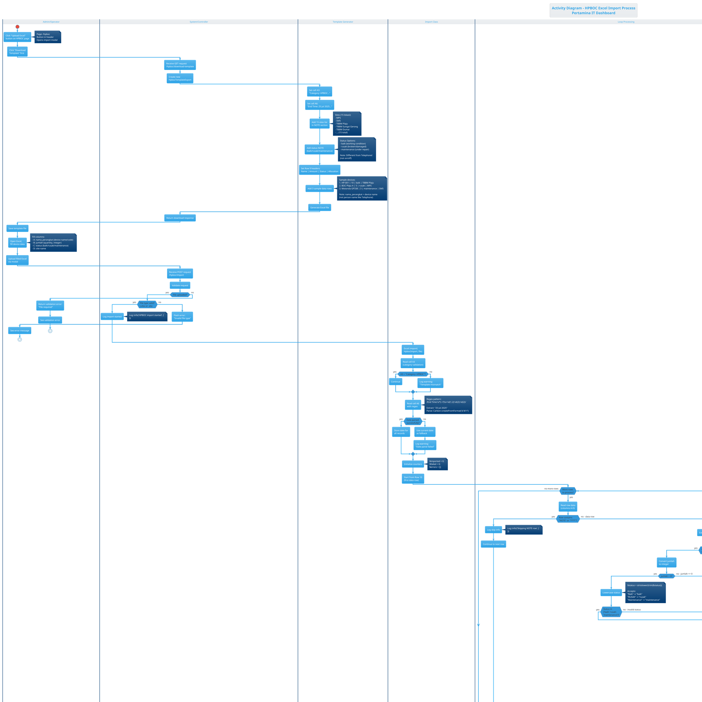

```plantuml
@startuml HPBOC_UseCase
!theme cerulean
skinparam packageStyle rectangle
skinparam actorBorderColor #2C3E50
skinparam usecaseBorderColor #3498DB

title Use Case Diagram - HPBOC Module\nPertamina IT Dashboard

' Actors
actor Admin as admin
actor Operator as operator
actor System as system

' Package: Device Management
package "Device Management" {
  usecase "View HPBOC\nList" as UC1
  usecase "Create HPBOC\nRecord" as UC2
  usecase "Update HPBOC\nRecord" as UC3
  usecase "Delete HPBOC\nRecord" as UC4
  usecase "Search HPBOC\nDevice" as UC5
  usecase "Update Device\nStatus" as UC6
}

' Package: Import/Export
package "Import/Export" {
  usecase "Download Excel\nTemplate" as UC7
  usecase "Upload Excel\nImport" as UC8
  usecase "Validate Excel\nFile" as UC9
  usecase "Parse Excel\nRows" as UC10
  usecase "Export HPBOC\nData" as UC11
}

' Package: Filtering & Reporting
package "Filtering & Reporting" {
  usecase "Filter by Site" as UC12
  usecase "Filter by Status" as UC13
  usecase "Filter by Date\nRange" as UC14
  usecase "View Statistics\nby Status" as UC15
  usecase "Generate Status\nReport" as UC16
}

' Package: System Operations
package "System Operations" {
  usecase "Lookup Site\n(LIKE query)" as UC17
  usecase "Validate Status\nEnum" as UC18
  usecase "Set Audit Trail\n(created_by/updated_by)" as UC19
  usecase "Log Import\nActivity" as UC20
  usecase "Generate Flash\nMessage" as UC21
  usecase "Validate Device\nQuantity" as UC22
}

' Relationships - Admin
admin --> UC1
admin --> UC2
admin --> UC3
admin --> UC4
admin --> UC5
admin --> UC6
admin --> UC7
admin --> UC8
admin --> UC11
admin --> UC12
admin --> UC13
admin --> UC14
admin --> UC15
admin --> UC16

' Relationships - Operator
operator --> UC1
operator --> UC2
operator --> UC3
operator --> UC5
operator --> UC6
operator --> UC7
operator --> UC8
operator --> UC12
operator --> UC13
operator --> UC14
operator --> UC15

' Relationships - System
system --> UC9
system --> UC10
system --> UC17
system --> UC18
system --> UC19
system --> UC20
system --> UC21
system --> UC22

' Include relationships
UC2 ..> UC19 : <<include>>
UC3 ..> UC19 : <<include>>
UC4 ..> UC19 : <<include>>
UC6 ..> UC19 : <<include>>

UC7 ..> UC17 : <<include>>

UC8 ..> UC9 : <<include>>
UC8 ..> UC10 : <<include>>
UC8 ..> UC20 : <<include>>

UC10 ..> UC17 : <<include>>
UC10 ..> UC18 : <<include>>
UC10 ..> UC22 : <<include>>

UC2 ..> UC17 : <<include>>
UC2 ..> UC18 : <<include>>
UC2 ..> UC22 : <<include>>

UC3 ..> UC17 : <<include>>
UC3 ..> UC18 : <<include>>
UC3 ..> UC22 : <<include>>

UC15 ..> UC13 : <<include>>
UC16 ..> UC13 : <<include>>
UC16 ..> UC14 : <<include>>

' Extend relationships
UC8 ..> UC21 : <<extend>>
UC2 ..> UC21 : <<extend>>
UC3 ..> UC21 : <<extend>>
UC4 ..> UC21 : <<extend>>
UC6 ..> UC21 : <<extend>>

' Notes
note right of UC2
  Device Fields:
  - nama_perangkat (device name/code)
    Example: "HP-001", "BOC Plaju A"
  - jumlah (quantity, integer > 0)
  - status (baik/rusak/maintenance)
  - site_id (15 lokasi Pertamina)
end note

note right of UC6
  Status Update Flow:
  1. Select device from list
  2. Choose new status:
     - Baik (working)
     - Rusak (broken)
     - Maintenance (under repair)
  3. System updates updated_by
  4. Flash success message
end note

note right of UC8
  Template Excel Structure:
  - Cell A3: "Category: HPBOC..."
  - Cell A6: "End Time: [date]..."
  - Row 9: Headers
    (Name | Amount | Status | Allocation)
  - Row 10+: Data
  - NOTE rows (skip in import)
end note

note bottom of UC10
  Validation Rules:
  1. Skip rows with "NOTE" or "****"
  2. Column A = nama_perangkat (required)
  3. Column B = jumlah (integer, > 0)
  4. Column C = status (baik/rusak/maintenance)
  5. Column D = site (lookup with LIKE)
  6. Date extracted from A6 with regex
end note

note right of UC18
  Status Enum Validation:
  
  HPBOC: baik/rusak/maintenance
  
  Different from:
  - Telephone: on/off/maintenance
  - Radio HT: on/off/maintenance
  
  Case-insensitive:
  "Baik" = "BAIK" = "baik" ✓
end note

note left of UC19
  Audit Trail:
  created_by = Auth::id() (on create)
  updated_by = Auth::id() (on update)
  
  Tracks who created/modified
  each device record
end note

note bottom of UC15
  Statistics View:
  - Total devices: 150
  - Status breakdown:
    * Baik: 120 (80%)
    * Rusak: 20 (13%)
    * Maintenance: 10 (7%)
  - Group by site
  - Chart visualization
end note

note right of UC17
  Site Lookup (LIKE query):
  
  Site::where('lokasi', 'LIKE', 
  '%' . $site . '%')->first()
  
  Flexible matching:
  "Plaju" → "TBBM Plaju" ✓
  "MPS" → "MPS" ✓
  "Gerong" → "TBBM Sungai Gerong" ✓
end note

@enduml
```

```plantuml
@startuml HPBOC_Sequence_Import
!theme cerulean
autonumber

title Sequence Diagram - HPBOC Excel Import\nPertamina IT Dashboard

actor "Admin/Operator" as User
participant "Browser/UI\n(React/Inertia)" as UI
participant "HpbocController" as Controller
participant "HpbocImport\n(Import Class)" as Importer
participant "Site Model" as SiteModel
participant "Hpboc Model" as HpbocModel
database "Database\n(SQLite/MySQL)" as DB
participant "Logger\n(Log::info/error)" as Logger
participant "Flash\n(Session)" as Flash

== Download Template Flow ==

User -> UI: Click "Download Template"
activate UI

UI -> Controller: GET /hpboc/download-template
activate Controller

Controller -> Controller: new HpbocTemplateExport()
activate Controller

note over Controller
  Template structure:
  - A3: "Category: HPBOC..."
  - A6: "End Time: 25 Jul 2025..."
  - NOTE sections:
    * 15 sites list
    * Status: baik/rusak/maintenance
  - Row 9: Headers
  - Row 10-12: Sample data
end note

Controller -> Controller: Generate Excel with styling
note right
  Sample devices:
  1. HP-001 | 10 | baik | TBBM Plaju
  2. BOC Plaju A | 5 | rusak | MPS
  3. Motorola GP338 | 3 | maintenance | SM5
  
  Note: Device names, not person names
end note

Controller --> UI: Download Excel file
deactivate Controller
deactivate Controller

UI --> User: Save template file
deactivate UI

User -> User: Open Excel, fill device data
note right
  Fill columns:
  A: nama_perangkat (e.g., "HP-002")
  B: jumlah (e.g., 8)
  C: status (e.g., "baik")
  D: site (e.g., "TBBM Plaju")
end note

== Upload Import Flow ==

User -> UI: Upload filled Excel via modal
activate UI

UI -> Controller: POST /hpboc/import\n(FormData: file)
activate Controller

Controller -> Controller: Validate request
note right
  Validation rules:
  - file: required
  - file: mimes:xlsx,xls
  - file: max:10240 (10MB)
end note

alt File validation failed
  Controller -> Flash: flash('error', 'Invalid file type')
  activate Flash
  Flash --> Controller: OK
  deactivate Flash
  
  Controller --> UI: Redirect back with errors
  deactivate Controller
  
  UI --> User: Show error message
  deactivate UI
  
  User -> UI: Fix and retry
  note right: Return to upload step
end

Controller -> Logger: Log::info('HPBOC import started')
activate Logger
Logger -> Logger: Write to storage/logs/laravel.log
note right
  Log entry:
  [timestamp] local.INFO: HPBOC import started
  {"user_id": 1, "filename": "hpboc_data.xlsx",
   "module": "hpboc"}
end note
Logger --> Controller: Logged
deactivate Logger

Controller -> Importer: Excel::import(new HpbocImport, file)
activate Importer

Importer -> Importer: Read cell A3 (category header)
note right
  Expected: "Category: HPBOC..."
  Validates correct template
end note

Importer -> Importer: Read cell A6 with regex
note right
  Regex: /End Time:\s*(.+?)\s+\d{1,2}:\d{2}:\d{2}/
  Extract: "25 Jul 2025"
  Parse: Carbon::createFromFormat('d M Y', $match)
end note

Importer -> Logger: Log::info('Date parsed', date)
activate Logger
Logger --> Importer: Logged
deactivate Logger

Importer -> Importer: Initialize counters\n($imported=0, $failed=0, $errors=[])

== Loop Through Rows ==

loop For each row starting from Row 10
  Importer -> Importer: Read row data (A, B, C, D)
  
  alt Row is NOTE row (contains "NOTE" or "****")
    Importer -> Logger: Log::info('Skipping NOTE row')
    activate Logger
    Logger --> Importer: Logged
    deactivate Logger
    
    note right: Continue to next iteration
    
  else Row is data row
    Importer -> Importer: Extract columns
    note right
      $nama_perangkat = $row[0]  // Column A
      $jumlah = $row[1]          // Column B
      $status = $row[2]          // Column C
      $site = $row[3]            // Column D
    end note
    
    alt Any column empty
      Importer -> Logger: Log::error('Empty columns', row)
      activate Logger
      Logger --> Importer: Logged
      deactivate Logger
      
      Importer -> Importer: Increment $failed
      Importer -> Importer: Add error to $errors array
      
    else All columns filled
      Importer -> Importer: $jumlah = (int) $jumlah
      
      alt Quantity <= 0
        Importer -> Logger: Log::error('Invalid quantity', jumlah)
        activate Logger
        note right
          Log entry:
          {"row": 11, "jumlah": -5,
           "message": "Quantity must be > 0"}
        end note
        Logger --> Importer: Logged
        deactivate Logger
        
        Importer -> Importer: Increment $failed
        
      else Quantity > 0
        Importer -> Importer: $status = strtolower(trim($status))
        
        alt Status not in ['baik','rusak','maintenance']
          Importer -> Logger: Log::error('Invalid status', status)
          activate Logger
          note right
            Log entry:
            {"row": 12, "status": "bagus",
             "valid_values": ["baik","rusak","maintenance"],
             "message": "Invalid status enum"}
          end note
          Logger --> Importer: Logged
          deactivate Logger
          
          Importer -> Importer: Increment $failed
          
        else Status valid
          Importer -> SiteModel: Site::where('lokasi', 'LIKE',\n'%' . $site . '%')->first()
          activate SiteModel
          
          note over SiteModel
            LIKE query for flexible matching:
            Input: "Plaju" → Match: "TBBM Plaju"
            Input: "MPS" → Match: "MPS"
            Input: "Dumai" → Match: "TBBM Dumai"
          end note
          
          SiteModel -> DB: SELECT * FROM sites\nWHERE lokasi LIKE '%Plaju%'\nLIMIT 1
          activate DB
          DB --> SiteModel: Return site record or null
          deactivate DB
          
          SiteModel --> Importer: Return Site object or null
          deactivate SiteModel
          
          alt Site not found
            Importer -> Logger: Log::error('Site not found', site_name)
            activate Logger
            Logger --> Importer: Logged
            deactivate Logger
            
            Importer -> Importer: Increment $failed
            Importer -> Importer: Add to $errors
            
          else Site found
            Importer -> HpbocModel: Hpboc::create([...])
            activate HpbocModel
            
            note over HpbocModel
              Create with:
              - nama_perangkat: $nama_perangkat
              - jumlah: $jumlah (validated > 0)
              - status: $status (baik/rusak/maintenance)
              - site_id: $site->id
              - tanggal_pencatatan: $date
              - created_by: Auth::id() (audit trail)
              - updated_by: Auth::id() (audit trail)
            end note
            
            HpbocModel -> DB: INSERT INTO hpboc\nVALUES (...)
            activate DB
            
            alt Insert success
              DB --> HpbocModel: Return created record with ID
              deactivate DB
              
              HpbocModel --> Importer: Return Hpboc object
              deactivate HpbocModel
              
              Importer -> Importer: Increment $imported
              
              Importer -> Logger: Log::info('Device imported successfully')
              activate Logger
              note right
                Log entry:
                {"row": 10, "device": "HP-002",
                 "status": "baik", "quantity": 8,
                 "site": "TBBM Plaju"}
              end note
              Logger --> Importer: Logged
              deactivate Logger
              
            else Insert failed (DB error)
              DB --> HpbocModel: Throw exception
              deactivate DB
              HpbocModel --> Importer: Throw exception
              deactivate HpbocModel
              
              Importer -> Logger: Log::error('Insert failed', exception)
              activate Logger
              Logger --> Importer: Logged
              deactivate Logger
              
              Importer -> Importer: Increment $failed
              Importer -> Importer: Add to $errors
            end
          end
        end
      end
    end
  end
end

== Summary & Response ==

Importer -> Importer: Calculate totals\n($total = $imported + $failed)

Importer -> Importer: Calculate success rate\n($rate = ($imported / $total) * 100)

Importer -> Logger: Log::info('HPBOC import completed', stats)
activate Logger
note right
  Log entry:
  {"total_rows": 20, "imported": 18,
   "failed": 2, "success_rate": "90%",
   "user_id": 1, "module": "hpboc"}
end note
Logger --> Importer: Logged
deactivate Logger

Importer --> Controller: Return void\n(Excel::import doesn't return)
deactivate Importer

Controller -> Controller: Read counters/logs\nfor statistics

alt Has failures ($failed > 0)
  Controller -> Flash: session()->flash('warning',\n"Berhasil {$imported}, Gagal {$failed}")
  activate Flash
  note right
    Message:
    "Berhasil mengimport 18 data HPBOC.
    Gagal mengimport 2 data.
    Periksa format Excel dan status enum."
  end note
  Flash --> Controller: OK
  deactivate Flash
  
else All success ($failed == 0)
  Controller -> Flash: session()->flash('success',\n"Berhasil mengimport {$imported} data")
  activate Flash
  note right
    Message:
    "Berhasil mengimport 20 data HPBOC
    dari 20 baris."
  end note
  Flash --> Controller: OK
  deactivate Flash
end

Controller --> UI: Redirect to route('hpboc.index')
deactivate Controller

UI -> UI: Inertia.js detects redirect
UI -> UI: Auto-reload page data

UI -> Controller: GET /hpboc (refresh data)
activate Controller
Controller -> HpbocModel: Hpboc::with('site')->orderBy('created_at', 'desc')->get()
activate HpbocModel
HpbocModel -> DB: SELECT hpboc.*, sites.lokasi\nFROM hpboc\nJOIN sites ON hpboc.site_id = sites.id\nORDER BY created_at DESC
activate DB
DB --> HpbocModel: Return updated records with site info
deactivate DB
HpbocModel --> Controller: Collection
deactivate HpbocModel
Controller --> UI: Inertia response with data
deactivate Controller

UI -> UI: Update table with new devices
UI -> UI: Show flash message
UI -> UI: Apply status badge colors
note right
  Status badges:
  - baik → green badge
  - rusak → red badge
  - maintenance → yellow badge
end note

UI --> User: Display updated HPBOC list\nand success/warning message
deactivate UI

note over User
  Message examples:
  
  Success:
  "Berhasil mengimport 20 data HPBOC
  dari 20 baris."
  
  Warning:
  "Berhasil mengimport 18 data HPBOC.
  Gagal mengimport 2 data.
  Periksa format Excel dan status enum."
end note

@enduml
```

# UML DIAGRAMS - HPBOC MODULE

> **Module**: HPBOC (HP/BOC Devices)  
> **Priority**: HIGH  
> **Complexity**: MEDIUM  
> **Status**: ✅ Ready to Render  
> **Device Type**: HP (Handy Phone) & BOC (Base On Cloud) communication devices

---

## 📋 MODULE INFORMATION

**Description**: Manajemen perangkat HP/BOC (Handy Phone dan Base On Cloud) untuk komunikasi operasional Pertamina. Modul ini melacak kondisi dan lokasi perangkat komunikasi mobile di 15 site.

**Key Features**:
- CRUD HPBOC device records
- Excel Import/Export dengan template standar
- Site assignment (15 lokasi Pertamina)
- Status management (Baik/Rusak/Maintenance)
- Audit trail (created_by, updated_by)
- Device naming (nama_perangkat)

**Actors**:
- **Admin**: Full CRUD, import, export, delete, status update
- **Operator**: View, create, update (no delete)
- **System**: File storage, validation, site lookup, status validation

**Business Rules**:
- `nama_perangkat` wajib diisi dengan nama/kode device (contoh: "HP-001", "BOC Plaju A")
- Status: **baik/rusak/maintenance** (case-insensitive, berbeda dari Telephone!)
- Site lookup menggunakan LIKE query untuk fleksibilitas
- Excel template format standar (sama seperti modul lain)
- Skip rows yang mengandung "NOTE" atau "****"
- Tanggal diambil dari cell A6 menggunakan regex parsing
- Auto-fill audit fields (created_by, updated_by) dari Auth::id()
- Quantity (jumlah) wajib integer positif

**Tech Stack**:
- Controller: `HpbocController` (`app/Http/Controllers/HpbocController.php`)
- Model: `App\Models\Hpboc`
- Import Class: `App\Imports\HpbocImport`
- Export Class: `App\Exports\HpbocTemplateExport`
- View: `resources/js/pages/hpboc/index.jsx` (React + Inertia)
- Excel Library: Maatwebsite Excel 3.1

**Database Schema**:
```sql
TABLE: hpboc
- id: bigint (PK, auto_increment)
- nama_perangkat: string(255) - Device name/code
- jumlah: integer - Quantity of devices
- status: enum('baik','rusak','maintenance')
- site_id: bigint (FK → sites.id)
- tanggal_pencatatan: date - Recording date
- created_by: bigint (FK → users.id, nullable)
- updated_by: bigint (FK → users.id, nullable)
- created_at: timestamp
- updated_at: timestamp

INDEXES:
- PRIMARY KEY (id)
- FOREIGN KEY (site_id) REFERENCES sites(id)
- FOREIGN KEY (created_by) REFERENCES users(id)
- FOREIGN KEY (updated_by) REFERENCES users(id)
- INDEX (status) - for filtering
- INDEX (site_id) - for joins
```

**Sample Data**:
```
nama_perangkat: "HP-001", "BOC Plaju A", "Motorola GP338"
jumlah: 10, 5, 3
status: "baik", "rusak", "maintenance"
site: "TBBM Plaju", "MPS", "SM5"
```

**Status Enum Difference**:
- **HPBOC**: baik/rusak/maintenance
- **Telephone**: on/off/maintenance
- **Radio HT**: on/off/maintenance
- **PC Device**: baik/rusak/maintenance

---

---

# 🎯 USE CASE DIAGRAM - HPBOC

## Deskripsi
Diagram ini menggambarkan interaksi user (Admin & Operator) dengan sistem manajemen HPBOC (HP/BOC communication devices), termasuk CRUD operations dan Excel Import/Export functionality dengan focus pada status management (baik/rusak/maintenance).

---

## PlantUML Code



---

## Penjelasan Diagram

**Actors**:
1. **Admin**: Full access - CRUD, import, export, delete, status update, all filters, reporting
2. **Operator**: Limited access - View, create, update, status update, import, basic filters (no delete, no export)
3. **System**: Background operations - validation, site lookup, audit trail, logging

**Use Cases - Device Management** (6 use cases):
- **View HPBOC List**: Display all HP/BOC devices dengan pagination
- **Create HPBOC Record**: Form input dengan nama_perangkat, jumlah, status, site
- **Update HPBOC Record**: Edit existing device record
- **Delete HPBOC Record**: Admin only - soft/hard delete
- **Search HPBOC Device**: Search by nama_perangkat atau site
- **Update Device Status**: Quick status change (baik/rusak/maintenance)

**Use Cases - Import/Export** (5 use cases):
- **Download Excel Template**: Generate template dengan 15 sites, status options (baik/rusak/maintenance), sample data
- **Upload Excel Import**: Bulk import dari Excel file
- **Validate Excel File**: Check file type (.xlsx/.xls), structure, headers
- **Parse Excel Rows**: Loop rows, extract data, skip NOTE rows, validate each field
- **Export HPBOC Data**: Export ke Excel/CSV (Admin only)

**Use Cases - Filtering & Reporting** (5 use cases):
- **Filter by Site**: Dropdown 15 lokasi Pertamina
- **Filter by Status**: Baik/Rusak/Maintenance
- **Filter by Date Range**: Custom date range
- **View Statistics by Status**: Count dan percentage per status
- **Generate Status Report**: Export detailed status report

**Use Cases - System Operations** (6 use cases):
- **Lookup Site**: LIKE query untuk flexible matching
- **Validate Status Enum**: Check status in ['baik','rusak','maintenance']
- **Set Audit Trail**: Auto-fill created_by/updated_by
- **Log Import Activity**: Log::info untuk tracking
- **Generate Flash Message**: Success/warning/error messages
- **Validate Device Quantity**: Check jumlah > 0, integer

**Include Relationships**:
- Create/Update/Delete/UpdateStatus **include** Set Audit Trail (always executed)
- Upload Excel **include** Validate File, Parse Rows, Log Activity
- Parse Rows **include** Lookup Site, Validate Status, Validate Quantity
- Create/Update **include** Lookup Site, Validate Status, Validate Quantity
- Download Template **include** Lookup Site (untuk list 15 sites)
- View Statistics/Generate Report **include** Filter by Status

**Extend Relationships**:
- Create/Update/Delete/Upload/UpdateStatus **extend** Generate Flash Message (conditional)

**Key Differences from Telephone**:
- `nama_perangkat` (device name) vs `nama_pic` (person name)
- Status: **baik/rusak/maintenance** vs on/off/maintenance
- Sample data: "HP-001", "BOC Plaju A" vs "John Doe", "Jane Smith"
- Has "Update Device Status" quick action
- Has "View Statistics by Status" for tracking device health

---

## Validation Checklist

- [x] 3 Actors (Admin, Operator, System) dengan peran jelas
- [x] 22 Use cases covering all functionality
- [x] 4 Packages untuk grouping (Device Management, Import/Export, Filtering, System)
- [x] Include relationships untuk mandatory operations
- [x] Extend relationships untuk conditional operations
- [x] Notes menjelaskan device fields, status enum, validation rules
- [x] Status difference highlighted (baik/rusak vs on/off)
- [x] Statistics view explained
- [x] Site LIKE query documented

---

---

# 🔄 ACTIVITY DIAGRAM - HPBOC EXCEL IMPORT

## Deskripsi
Diagram ini menggambarkan alur aktivitas lengkap proses Excel Import untuk HPBOC, dari download template hingga summary report. Fokus pada validation status enum (baik/rusak/maintenance), site lookup, dan quantity validation.

---

## PlantUML Code



---

## Penjelasan Diagram

**Swimlanes**:
1. **Admin/Operator**: User actions (download, fill, upload)
2. **System/Controller**: Request handling dan response
3. **Template Generator**: Excel template creation (HpbocTemplateExport)
4. **Import Class**: Parsing dan validation (HpbocImport)
5. **Site Lookup**: Database query untuk site matching
6. **Database Insert**: Hpboc record creation
7. **Loop Processing**: Iterasi setiap row

**Primary Flow - Download Template**:
1. User klik "Download Template"
2. System create HpbocTemplateExport
3. Set header cells (A3: Category, A6: Date)
4. Add 15 sites NOTE
5. **Add status NOTE (baik/rusak/maintenance)** - berbeda dari Telephone!
6. Set headers Row 9
7. **Add 3 sample devices** (HP-001, BOC Plaju A, Motorola GP338)
8. Generate Excel
9. User download dan fill

**Primary Flow - Upload Import**:
1. User upload Excel
2. Controller validate file type
3. Import class read A3 (category validation)
4. Import class read A6 with regex (date extraction)
5. Initialize counters
6. Loop dari Row 10
7. **For each row**:
   - Skip if NOTE row
   - Extract columns (A=nama_perangkat, B=jumlah, C=status, D=site)
   - Validate all columns not empty
   - **Validate jumlah > 0** (quantity check)
   - Lowercase status
   - **Validate status enum (baik/rusak/maintenance)**
   - Site lookup dengan LIKE (flexible matching)
   - If site found → create Hpboc record
   - Set audit fields (created_by, updated_by)
   - Increment counters
   - Log activity
8. Calculate totals dan success rate
9. Flash message (success/warning)
10. Redirect dan auto-refresh

**Decision Points** (11 nodes):
- File uploaded?
- File type valid?
- A3 header valid?
- Date parsed?
- More rows?
- Is NOTE row?
- All columns not empty?
- Jumlah > 0?
- Status valid?
- Site found?
- Insert success?
- Any failures?

**Error Branches**:
- Invalid file type → abort
- Empty columns → skip row, increment failed
- Jumlah <= 0 → skip row, log error
- **Invalid status** (not in baik/rusak/maintenance) → skip row, log error
- Site not found → skip row, log error
- Insert failure → skip row, log error

**Validation Points**:
1. **File validation**: type, size
2. **Template validation**: A3 header
3. **Date validation**: regex parsing
4. **Row validation**: skip NOTE rows
5. **Column validation**: all not empty
6. **Quantity validation**: integer > 0
7. **Status validation**: baik/rusak/maintenance (case-insensitive)
8. **Site validation**: LIKE query, must exist
9. **Insert validation**: DB constraints

**Logging Points**:
- Import started
- Template header validation
- Date parsing warning
- Skip NOTE row
- Row imported successfully
- Each error type (empty, invalid quantity, invalid status, site not found, insert failed)
- Import summary (total, imported, failed, success rate)

**Unique Features vs Telephone**:
- **nama_perangkat** (device name) vs nama_pic (person name)
- **Status enum**: baik/rusak/maintenance vs on/off/maintenance
- **Sample data**: "HP-001", "BOC Plaju A" vs "John Doe", "Jane Smith"
- **Quantity validation**: explicit > 0 check
- **Success rate**: calculated in summary

---

## Validation Checklist

- [x] Start dan End states clear
- [x] 7 Swimlanes untuk separation of concerns
- [x] Download template flow lengkap
- [x] Upload import flow lengkap
- [x] Loop processing untuk rows
- [x] 12 Decision nodes untuk validation
- [x] Error branches dengan recovery/logging
- [x] Notes menjelaskan business logic
- [x] Status enum (baik/rusak/maintenance) highlighted
- [x] Sample data (HP-001, BOC, Motorola) shown
- [x] Quantity validation included
- [x] Logging points marked
- [x] Success rate calculation shown

---

---

# 🔀 SEQUENCE DIAGRAM - HPBOC EXCEL IMPORT

## Deskripsi
Diagram ini menggambarkan interaksi detail antar komponen sistem saat Admin/Operator melakukan Excel Import untuk HPBOC devices. Fokus pada message passing, validation (quantity dan status enum), site lookup, dan audit trail.

---

## PlantUML Code



---

## Penjelasan Diagram

**Participants** (9 komponen):
1. **Admin/Operator**: End user melakukan import
2. **Browser/UI**: React/Inertia frontend
3. **HpbocController**: Laravel controller
4. **HpbocImport**: Import class (Maatwebsite Excel)
5. **Site Model**: Eloquent model untuk site lookup
6. **Hpboc Model**: Eloquent model untuk insert devices
7. **Database**: SQLite/MySQL storage
8. **Logger**: Log::info/error untuk audit trail
9. **Flash**: Session flash messages

**Flow Structure**:
- **Download Template** (Steps 1-10): Generate dan download template
- **Upload Import** (Steps 11-22): Validate file dan start import
- **Loop Through Rows** (Steps 23-70): Parse, validate, insert each row
- **Summary & Response** (Steps 71-85): Calculate stats, flash message, redirect

**Download Template Flow** (Steps 1-10):
1. User click "Download Template"
2. UI send GET request
3. Controller create HpbocTemplateExport
4. Generate Excel dengan structure khusus (A3, A6, NOTEs)
5. **Sample devices**: "HP-001", "BOC Plaju A", "Motorola GP338"
6. **Status NOTE**: baik/rusak/maintenance (berbeda dari Telephone)
7. Return download response
8. User save dan fill template

**Upload Import Flow** (Steps 11-22):
1. User upload filled Excel
2. UI POST dengan FormData
3. Controller validate file (required, mimes, max size)
4. **Alt block**: If validation failed → flash error → retry
5. Log import started dengan user_id, filename, module
6. Call Excel::import dengan HpbocImport class
7. Read A3 (category validation)
8. Read A6 dengan regex (date extraction)
9. Initialize counters

**Loop Processing** (Steps 23-70):
- **For each row** starting Row 10
- **Nested alt blocks** untuk validation:
  1. **Is NOTE row?** → Skip dengan logging
  2. **Columns empty?** → Increment failed, log error
  3. **Quantity <= 0?** → Increment failed, log error (unique validation!)
  4. **Status invalid?** → Increment failed, log error (baik/rusak/maintenance)
  5. **Site lookup** dengan LIKE query:
     - SiteModel query database
     - Flexible matching ("Plaju" → "TBBM Plaju")
  6. **Site not found?** → Increment failed, log error
  7. **Site found** → Create Hpboc:
     - Map columns (A=nama_perangkat, B=jumlah, C=status, D=site_id)
     - **Validate jumlah > 0** before insert
     - **Set audit fields** (created_by, updated_by)
     - Insert to database
  8. **Insert success?** → Increment imported, log success
  9. **Insert failed?** → Increment failed, log error

**Summary Flow** (Steps 71-85):
1. Calculate totals ($imported + $failed)
2. **Calculate success rate** (percentage)
3. Log import completed summary (with success rate)
4. **Alt block**: Has failures?
   - Yes → Flash warning message (detailed)
   - No → Flash success message
5. Redirect to hpboc.index
6. Inertia auto-reload page
7. Fetch updated data (Hpboc::with('site')->orderBy('created_at', 'desc'))
8. Display flash message
9. **Apply status badge colors** (baik=green, rusak=red, maintenance=yellow)
10. Show updated table

**Error Handling** (5 scenarios):
- File validation error (step 18) → alt block dengan retry
- Empty columns (step 30) → skip row, log
- Invalid quantity (step 36) → skip row, log
- Invalid status (step 43) → skip row, log
- Site not found (step 57) → skip row, log
- Insert failure (step 67) → skip row, log

**Activation Boxes**:
- Show processing time untuk setiap participant
- Nested activations untuk create operations
- Database queries highlighted

**Return Messages** (dashed arrows):
- Site lookup result (found/null)
- Database insert result (success/exception)
- Log confirmation
- Flash message confirmation

**Key Features Highlighted**:
1. **nama_perangkat** (device name) in create data
2. **Status enum**: baik/rusak/maintenance (NOT on/off)
3. **Quantity validation**: explicit > 0 check
4. **Sample devices**: HP-001, BOC Plaju A, Motorola GP338
5. **LIKE query** untuk site lookup dengan contoh
6. **Audit trail** (created_by, updated_by)
7. **Regex parsing** untuk date extraction
8. **Logging** di setiap critical step
9. **Flash messages** conditional (success/warning)
10. **Success rate** calculation
11. **Status badge colors** in UI

**Notes Included**:
- Template structure (A3, A6, rows)
- Sample data examples (device names, not person names)
- Validation rules (quantity > 0, status enum)
- LIKE query matching examples
- Log entry formats
- Flash message examples
- Status badge colors

---

## Validation Checklist

- [x] 9 Participants lengkap (User, UI, Controller, Import, Models, DB, Logger, Flash)
- [x] Autonumbering untuk 85+ steps
- [x] Activation boxes menunjukkan processing time
- [x] Download template flow (steps 1-10)
- [x] Upload import flow (steps 11-22)
- [x] Loop processing dengan nested validations (steps 23-70)
- [x] Summary & response flow (steps 71-85)
- [x] Alt blocks untuk error handling (6 scenarios)
- [x] Quantity validation (> 0) included
- [x] Status enum validation (baik/rusak/maintenance) dijelaskan
- [x] Site LIKE query dijelaskan dengan contoh
- [x] Audit trail (created_by/updated_by) ditampilkan
- [x] Logging points di setiap critical step
- [x] Flash messages conditional
- [x] Success rate calculation shown
- [x] Status badge colors documented
- [x] Return messages (dashed arrows)
- [x] Notes menjelaskan business logic

---

---

# 📊 RENDERING INSTRUCTIONS

## Online Tools (Recommended for Quick Preview)

### PlantUML Online Editor
1. **URL**: https://www.plantuml.com/plantuml/uml/
2. **Steps**:
   - Copy salah satu PlantUML code di atas
   - Paste ke text area
   - Click "Submit" atau tekan Ctrl+Enter
   - Diagram akan muncul di kanan
3. **Download**:
   - Right-click diagram → Save image as...
   - Format: PNG (default), SVG (scalable), PDF (print)

### PlantText (Alternative)
1. **URL**: https://www.planttext.com/
2. **Steps**:
   - Paste PlantUML code
   - Auto-render di preview panel
   - Click "Download" untuk save

---

## VSCode Extension (Recommended for Development)

### Setup
```bash
# Install extension
# Search: "PlantUML" by jebbs in VSCode marketplace
# Or install via command line:
code --install-extension jebbs.plantuml
```

### Prerequisites
- **Java**: Download from https://www.java.com/
- **Graphviz** (optional, for better layouts):
  ```bash
  # Windows (PowerShell as Admin)
  choco install graphviz
  
  # Or download installer
  # https://graphviz.org/download/
  ```

### Usage
1. Create file: `hpboc-usecase.puml`
2. Paste PlantUML code
3. **Preview**: Press `Alt+D` (Windows/Linux) or `Option+D` (Mac)
4. **Export**:
   - Right-click diagram in preview
   - Select "Export Current Diagram"
   - Choose format (PNG/SVG/PDF)
   - Select output directory

---

## Command Line (For Batch Processing)

### Generate Diagrams

**Single file**:
```bash
# Generate PNG (default)
plantuml hpboc-usecase.puml

# Generate SVG (scalable)
plantuml -tsvg hpboc-usecase.puml

# Generate PDF
plantuml -tpdf hpboc-usecase.puml
```

**Multiple files**:
```bash
# All .puml files in current directory
plantuml *.puml

# With specific output directory
plantuml -o ./output *.puml

# SVG format for all files
plantuml -tsvg *.puml
```

---

## Export Format Recommendations

### For Documentation (Laporan KP)
- **Format**: SVG or PDF
- **Why**: Scalable, professional, sharp text
- **Command**: `plantuml -tsvg hpboc-*.puml`

### For Presentation (PowerPoint)
- **Format**: PNG with high DPI
- **Why**: Compatible, easy to resize
- **Command**: `plantuml -tpng hpboc-*.puml`

### For Web/GitHub README
- **Format**: SVG or PNG
- **Embed**: 
  ```markdown
  
  ```

---

## File Organization

### Recommended Structure
```
docs/
├── diagrams/
│   ├── dashboard/
│   ├── telephone/
│   ├── hpboc/
│   │   ├── hpboc-usecase.puml
│   │   ├── hpboc-usecase.svg
│   │   ├── hpboc-activity.puml
│   │   ├── hpboc-activity.svg
│   │   ├── hpboc-sequence.puml
│   │   └── hpboc-sequence.svg
│   └── ...
└── DIAGRAMS_HPBOC.md (this file)
```

### Batch Export Script

**PowerShell**:
```powershell
# Create output directories
New-Item -ItemType Directory -Force -Path "docs/diagrams/hpboc"

# Export all HPBOC diagrams
plantuml -tsvg -o "docs/diagrams/hpboc" docs/hpboc-*.puml
```

---

# ✅ COMPLETION CHECKLIST

HPBOC Module Diagrams:
- [x] Use Case Diagram created (22 use cases, 3 actors)
- [x] Activity Diagram created (Excel import flow, 7 swimlanes, quantity validation)
- [x] Sequence Diagram created (85+ steps, download + import, success rate)
- [ ] Diagrams rendered successfully (your task)
- [ ] Diagrams exported to PNG/SVG/PDF
- [ ] Diagrams reviewed for accuracy
- [ ] Diagrams integrated to documentation

---

# 🎯 NEXT STEPS

## Immediate Actions

1. **Render Diagrams Now**
   - Open https://www.plantuml.com/plantuml/uml/
   - Copy Use Case code → Render → Download SVG
   - Copy Activity code → Render → Download SVG
   - Copy Sequence code → Render → Download SVG

2. **Verify Diagrams**
   - Check status enum (baik/rusak/maintenance) correct
   - Verify quantity validation included
   - Confirm device names (not person names)
   - Validate audit trail included
   - Check success rate calculation

3. **Save & Organize**
   - Save PlantUML source (`.puml` files)
   - Save rendered images (`.svg` or `.png`)
   - Create `docs/diagrams/hpboc/` folder
   - Commit to Git repository

## Continue with Other Modules

**Recommended Next**:
- **Radio HT** (very similar to HPBOC - status: on/off/maintenance)
- **PC Device** (unique: NO SITE relation, alokasi MPS/SM5)

**Or pick from**:
- Dashboard (already done! ✅)
- Telephone (already done! ✅)
- Network Device (monitoring: up/down/availability)
- CCTV (complex: readiness report)
- Ticket (different domain: IT support)

---

# 📝 NOTES & TIPS

## Key Differences - HPBOC vs Other Modules

| Feature | HPBOC | Telephone | Radio HT | PC Device |
|---------|-------|-----------|----------|-----------|
| Name Column | `nama_perangkat` (device) | `nama_pic` (person) | `nama_perangkat` | `nama_perangkat` |
| Sample Data | "HP-001", "BOC Plaju A" | "John Doe" | "Radio HT-01" | "PC-001" |
| Status Values | baik/rusak/maintenance | on/off/maintenance | on/off/maintenance | baik/rusak/maintenance |
| Site Relation | Yes (site_id FK) | Yes | Yes | **NO** |
| Unique Validation | Quantity > 0 | nama_pic format | frequency field | alokasi (MPS/SM5) |

## Common Status Enums Across Modules

**baik/rusak/maintenance**:
- HPBOC ✅
- PC Device ✅

**on/off/maintenance**:
- Telephone ✅
- Radio HT ✅

**Custom**:
- Network Device: up/down/maintenance/offline
- CCTV: online/offline/maintenance
- Ticket: open/in_progress/resolved/closed

---

**Status**: ✅ HPBOC diagrams ready to render!

**File created**: `docs/DIAGRAMS_HPBOC.md`  
**Date**: October 31, 2025  
**Module**: HPBOC (3 of 8 modules)  
**Previous**: Dashboard ✅, Telephone ✅  
**Next**: Radio HT (recommended - very similar pattern) or user choice
