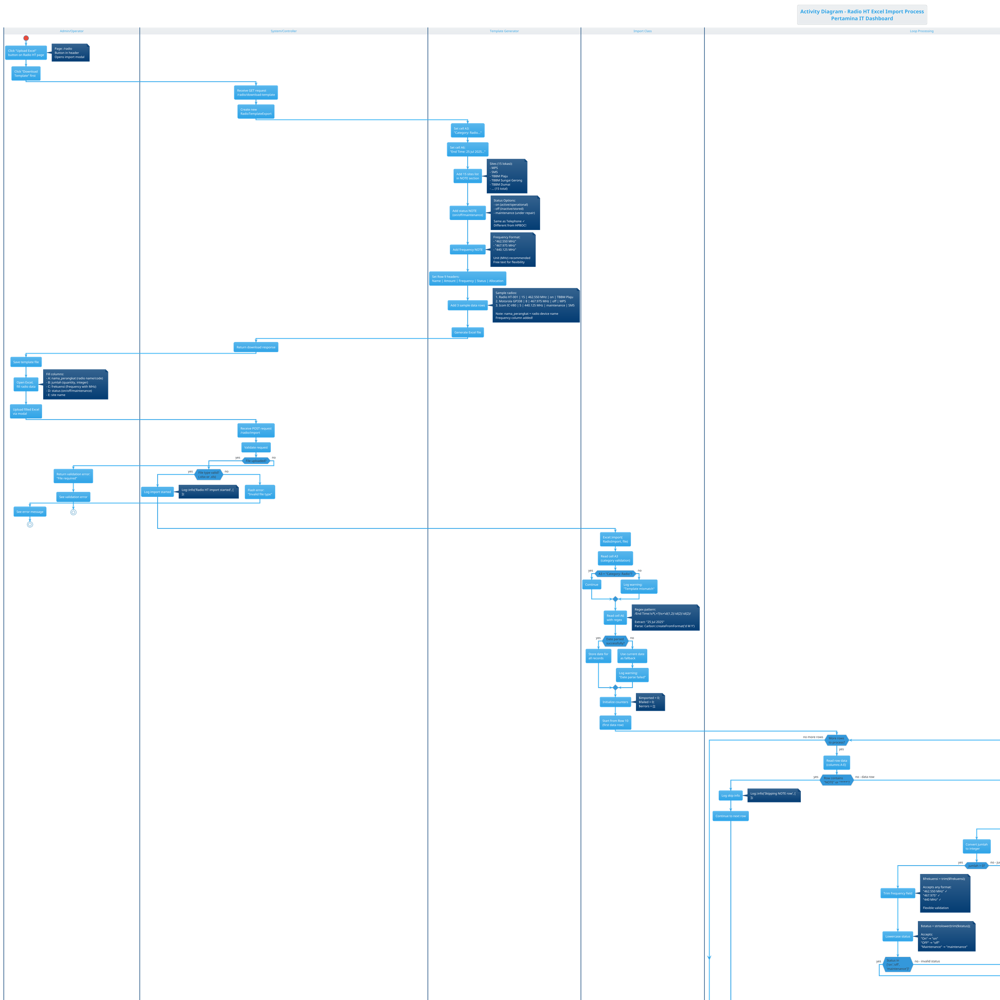

```plantuml
@startuml RadioHT_UseCase
!theme cerulean
skinparam packageStyle rectangle
skinparam actorBorderColor #2C3E50
skinparam usecaseBorderColor #3498DB

title Use Case Diagram - Radio HT Module\nPertamina IT Dashboard

' Actors
actor Admin as admin
actor Operator as operator
actor System as system

' Package: Device Management
package "Device Management" {
  usecase "View Radio HT\nList" as UC1
  usecase "Create Radio HT\nRecord" as UC2
  usecase "Update Radio HT\nRecord" as UC3
  usecase "Delete Radio HT\nRecord" as UC4
  usecase "Search Radio\nDevice" as UC5
  usecase "Update Device\nStatus" as UC6
  usecase "Manage Radio\nFrequency" as UC7
}

' Package: Import/Export
package "Import/Export" {
  usecase "Download Excel\nTemplate" as UC8
  usecase "Upload Excel\nImport" as UC9
  usecase "Validate Excel\nFile" as UC10
  usecase "Parse Excel\nRows" as UC11
  usecase "Export Radio\nData" as UC12
}

' Package: Filtering & Reporting
package "Filtering & Reporting" {
  usecase "Filter by Site" as UC13
  usecase "Filter by Status" as UC14
  usecase "Filter by Date\nRange" as UC15
  usecase "Filter by\nFrequency" as UC16
  usecase "View Statistics\nby Status" as UC17
  usecase "Generate Status\nReport" as UC18
  usecase "View Frequency\nAllocation" as UC19
}

' Package: System Operations
package "System Operations" {
  usecase "Lookup Site\n(LIKE query)" as UC20
  usecase "Validate Status\nEnum" as UC21
  usecase "Set Audit Trail\n(created_by/updated_by)" as UC22
  usecase "Log Import\nActivity" as UC23
  usecase "Generate Flash\nMessage" as UC24
  usecase "Validate Device\nQuantity" as UC25
  usecase "Validate Frequency\nFormat" as UC26
}

' Relationships - Admin
admin --> UC1
admin --> UC2
admin --> UC3
admin --> UC4
admin --> UC5
admin --> UC6
admin --> UC7
admin --> UC8
admin --> UC9
admin --> UC12
admin --> UC13
admin --> UC14
admin --> UC15
admin --> UC16
admin --> UC17
admin --> UC18
admin --> UC19

' Relationships - Operator
operator --> UC1
operator --> UC2
operator --> UC3
operator --> UC5
operator --> UC6
operator --> UC7
operator --> UC8
operator --> UC9
operator --> UC13
operator --> UC14
operator --> UC15
operator --> UC16
operator --> UC17
operator --> UC19

' Relationships - System
system --> UC10
system --> UC11
system --> UC20
system --> UC21
system --> UC22
system --> UC23
system --> UC24
system --> UC25
system --> UC26

' Include relationships
UC2 ..> UC22 : <<include>>
UC3 ..> UC22 : <<include>>
UC4 ..> UC22 : <<include>>
UC6 ..> UC22 : <<include>>
UC7 ..> UC22 : <<include>>

UC8 ..> UC20 : <<include>>

UC9 ..> UC10 : <<include>>
UC9 ..> UC11 : <<include>>
UC9 ..> UC23 : <<include>>

UC11 ..> UC20 : <<include>>
UC11 ..> UC21 : <<include>>
UC11 ..> UC25 : <<include>>
UC11 ..> UC26 : <<include>>

UC2 ..> UC20 : <<include>>
UC2 ..> UC21 : <<include>>
UC2 ..> UC25 : <<include>>
UC2 ..> UC26 : <<include>>

UC3 ..> UC20 : <<include>>
UC3 ..> UC21 : <<include>>
UC3 ..> UC25 : <<include>>
UC3 ..> UC26 : <<include>>

UC7 ..> UC26 : <<include>>

UC17 ..> UC14 : <<include>>
UC18 ..> UC14 : <<include>>
UC18 ..> UC15 : <<include>>

UC19 ..> UC16 : <<include>>

' Extend relationships
UC9 ..> UC24 : <<extend>>
UC2 ..> UC24 : <<extend>>
UC3 ..> UC24 : <<extend>>
UC4 ..> UC24 : <<extend>>
UC6 ..> UC24 : <<extend>>
UC7 ..> UC24 : <<extend>>

' Notes
note right of UC2
  Radio HT Fields:
  - nama_perangkat (radio name/code)
    Example: "Radio HT-001", "Motorola GP338"
  - jumlah (quantity, integer > 0)
  - frekuensi (frequency, e.g., "462.550 MHz")
  - status (on/off/maintenance)
  - site_id (15 lokasi Pertamina)
end note

note right of UC7
  Frequency Management:
  - Update radio frequency
  - Format: "XXX.XXX MHz"
  - Example: "462.550 MHz"
  - Important for radio coordination
  - Prevents frequency conflicts
end note

note right of UC9
  Template Excel Structure:
  - Cell A3: "Category: Radio..."
  - Cell A6: "End Time: [date]..."
  - Row 9: Headers
    (Name | Amount | Frequency | Status | Allocation)
  - Row 10+: Data
  - NOTE rows (skip in import)
end note

note bottom of UC11
  Validation Rules:
  1. Skip rows with "NOTE" or "****"
  2. Column A = nama_perangkat (required)
  3. Column B = jumlah (integer, > 0)
  4. Column C = frekuensi (free text with MHz)
  5. Column D = status (on/off/maintenance)
  6. Column E = site (lookup with LIKE)
  7. Date extracted from A6 with regex
end note

note right of UC21
  Status Enum Validation:
  
  Radio HT: on/off/maintenance
  
  Same as Telephone ✓
  Different from HPBOC (baik/rusak/maintenance)
  
  Case-insensitive:
  "On" = "ON" = "on" ✓
  "Off" = "OFF" = "off" ✓
end note

note right of UC26
  Frequency Validation:
  
  Format: Free text (flexible)
  Recommended: "XXX.XXX MHz"
  
  Valid examples:
  - "462.550 MHz" ✓
  - "467.975 MHz" ✓
  - "440.125" ✓ (unit optional)
  
  Not strictly enforced for flexibility
end note

note left of UC22
  Audit Trail:
  created_by = Auth::id() (on create)
  updated_by = Auth::id() (on update)
  
  Tracks who created/modified
  each radio record
end note

note bottom of UC17
  Statistics View:
  - Total radios: 200
  - Status breakdown:
    * On: 170 (85%)
    * Off: 20 (10%)
    * Maintenance: 10 (5%)
  - Group by site
  - Group by frequency range
  - Chart visualization
end note

note right of UC19
  Frequency Allocation View:
  
  Shows all frequencies in use:
  - 462.550 MHz: 50 units (5 sites)
  - 467.975 MHz: 30 units (3 sites)
  - 440.125 MHz: 20 units (2 sites)
  
  Helps prevent frequency conflicts
  Useful for radio coordination
end note

note right of UC20
  Site Lookup (LIKE query):
  
  Site::where('lokasi', 'LIKE', 
  '%' . $site . '%')->first()
  
  Flexible matching:
  "Plaju" → "TBBM Plaju" ✓
  "MPS" → "MPS" ✓
  "Gerong" → "TBBM Sungai Gerong" ✓
end note

@enduml
```

```plantuml
@startuml RadioHT_Sequence_Import
!theme cerulean
autonumber

title Sequence Diagram - Radio HT Excel Import\nPertamina IT Dashboard

actor "Admin/Operator" as User
participant "Browser/UI\n(React/Inertia)" as UI
participant "RadioController" as Controller
participant "RadioImport\n(Import Class)" as Importer
participant "Site Model" as SiteModel
participant "Radio Model" as RadioModel
database "Database\n(SQLite/MySQL)" as DB
participant "Logger\n(Log::info/error)" as Logger
participant "Flash\n(Session)" as Flash

== Download Template Flow ==

User -> UI: Click "Download Template"
activate UI

UI -> Controller: GET /radio/download-template
activate Controller

Controller -> Controller: new RadioTemplateExport()
activate Controller

note over Controller
  Template structure:
  - A3: "Category: Radio..."
  - A6: "End Time: 25 Jul 2025..."
  - NOTE sections:
    * 15 sites list
    * Status: on/off/maintenance
    * Frequency: format examples
  - Row 9: Headers (with Frequency!)
  - Row 10-12: Sample data
end note

Controller -> Controller: Generate Excel with styling
note right
  Sample radios:
  1. Radio HT-001 | 15 | 462.550 MHz | on | TBBM Plaju
  2. Motorola GP338 | 8 | 467.975 MHz | off | MPS
  3. Icom IC-V80 | 5 | 440.125 MHz | maintenance | SM5
  
  Note: Radio device names
  Frequency column included!
end note

Controller --> UI: Download Excel file
deactivate Controller
deactivate Controller

UI --> User: Save template file
deactivate UI

User -> User: Open Excel, fill radio data
note right
  Fill columns:
  A: nama_perangkat (e.g., "Radio HT-002")
  B: jumlah (e.g., 10)
  C: frekuensi (e.g., "462.550 MHz")
  D: status (e.g., "on")
  E: site (e.g., "TBBM Plaju")
end note

== Upload Import Flow ==

User -> UI: Upload filled Excel via modal
activate UI

UI -> Controller: POST /radio/import\n(FormData: file)
activate Controller

Controller -> Controller: Validate request
note right
  Validation rules:
  - file: required
  - file: mimes:xlsx,xls
  - file: max:10240 (10MB)
end note

alt File validation failed
  Controller -> Flash: flash('error', 'Invalid file type')
  activate Flash
  Flash --> Controller: OK
  deactivate Flash
  
  Controller --> UI: Redirect back with errors
  deactivate Controller
  
  UI --> User: Show error message
  deactivate UI
  
  User -> UI: Fix and retry
  note right: Return to upload step
end

Controller -> Logger: Log::info('Radio HT import started')
activate Logger
Logger -> Logger: Write to storage/logs/laravel.log
note right
  Log entry:
  [timestamp] local.INFO: Radio HT import started
  {"user_id": 1, "filename": "radio_data.xlsx",
   "module": "radio"}
end note
Logger --> Controller: Logged
deactivate Logger

Controller -> Importer: Excel::import(new RadioImport, file)
activate Importer

Importer -> Importer: Read cell A3 (category header)
note right
  Expected: "Category: Radio..."
  Validates correct template
end note

Importer -> Importer: Read cell A6 with regex
note right
  Regex: /End Time:\s*(.+?)\s+\d{1,2}:\d{2}:\d{2}/
  Extract: "25 Jul 2025"
  Parse: Carbon::createFromFormat('d M Y', $match)
end note

Importer -> Logger: Log::info('Date parsed', date)
activate Logger
Logger --> Importer: Logged
deactivate Logger

Importer -> Importer: Initialize counters\n($imported=0, $failed=0, $errors=[])

== Loop Through Rows ==

loop For each row starting from Row 10
  Importer -> Importer: Read row data (A, B, C, D, E)
  
  alt Row is NOTE row (contains "NOTE" or "****")
    Importer -> Logger: Log::info('Skipping NOTE row')
    activate Logger
    Logger --> Importer: Logged
    deactivate Logger
    
    note right: Continue to next iteration
    
  else Row is data row
    Importer -> Importer: Extract columns
    note right
      $nama_perangkat = $row[0]  // Column A
      $jumlah = $row[1]          // Column B
      $frekuensi = $row[2]       // Column C (unique!)
      $status = $row[3]          // Column D
      $site = $row[4]            // Column E
    end note
    
    alt Any required column empty
      Importer -> Logger: Log::error('Empty required columns', row)
      activate Logger
      Logger --> Importer: Logged
      deactivate Logger
      
      Importer -> Importer: Increment $failed
      Importer -> Importer: Add error to $errors array
      
    else All required columns filled
      Importer -> Importer: $jumlah = (int) $jumlah
      
      alt Quantity <= 0
        Importer -> Logger: Log::error('Invalid quantity', jumlah)
        activate Logger
        note right
          Log entry:
          {"row": 11, "jumlah": -5,
           "message": "Quantity must be > 0"}
        end note
        Logger --> Importer: Logged
        deactivate Logger
        
        Importer -> Importer: Increment $failed
        
      else Quantity > 0
        Importer -> Importer: $frekuensi = trim($frekuensi)
        note right
          Frequency validation:
          - Trim whitespace
          - No strict format check (flexible)
          - Can be empty (optional)
          
          Accepted:
          "462.550 MHz" ✓
          "467.975" ✓
          "440 MHz" ✓
          "" ✓ (optional)
        end note
        
        Importer -> Importer: $status = strtolower(trim($status))
        
        alt Status not in ['on','off','maintenance']
          Importer -> Logger: Log::error('Invalid status', status)
          activate Logger
          note right
            Log entry:
            {"row": 12, "status": "active",
             "valid_values": ["on","off","maintenance"],
             "message": "Invalid status enum"}
          end note
          Logger --> Importer: Logged
          deactivate Logger
          
          Importer -> Importer: Increment $failed
          
        else Status valid
          Importer -> SiteModel: Site::where('lokasi', 'LIKE',\n'%' . $site . '%')->first()
          activate SiteModel
          
          note over SiteModel
            LIKE query for flexible matching:
            Input: "Plaju" → Match: "TBBM Plaju"
            Input: "MPS" → Match: "MPS"
            Input: "Dumai" → Match: "TBBM Dumai"
          end note
          
          SiteModel -> DB: SELECT * FROM sites\nWHERE lokasi LIKE '%Plaju%'\nLIMIT 1
          activate DB
          DB --> SiteModel: Return site record or null
          deactivate DB
          
          SiteModel --> Importer: Return Site object or null
          deactivate SiteModel
          
          alt Site not found
            Importer -> Logger: Log::error('Site not found', site_name)
            activate Logger
            Logger --> Importer: Logged
            deactivate Logger
            
            Importer -> Importer: Increment $failed
            Importer -> Importer: Add to $errors
            
          else Site found
            Importer -> RadioModel: Radio::create([...])
            activate RadioModel
            
            note over RadioModel
              Create with:
              - nama_perangkat: $nama_perangkat
              - jumlah: $jumlah (validated > 0)
              - frekuensi: $frekuensi (unique field!)
              - status: $status (on/off/maintenance)
              - site_id: $site->id
              - tanggal_pencatatan: $date
              - created_by: Auth::id() (audit trail)
              - updated_by: Auth::id() (audit trail)
            end note
            
            RadioModel -> DB: INSERT INTO radio\nVALUES (...)
            activate DB
            
            alt Insert success
              DB --> RadioModel: Return created record with ID
              deactivate DB
              
              RadioModel --> Importer: Return Radio object
              deactivate RadioModel
              
              Importer -> Importer: Increment $imported
              
              Importer -> Logger: Log::info('Radio imported successfully')
              activate Logger
              note right
                Log entry:
                {"row": 10, "device": "Radio HT-002",
                 "frequency": "462.550 MHz",
                 "status": "on", "quantity": 10,
                 "site": "TBBM Plaju"}
              end note
              Logger --> Importer: Logged
              deactivate Logger
              
            else Insert failed (DB error)
              DB --> RadioModel: Throw exception
              deactivate DB
              RadioModel --> Importer: Throw exception
              deactivate RadioModel
              
              Importer -> Logger: Log::error('Insert failed', exception)
              activate Logger
              Logger --> Importer: Logged
              deactivate Logger
              
              Importer -> Importer: Increment $failed
              Importer -> Importer: Add to $errors
            end
          end
        end
      end
    end
  end
end

== Summary & Response ==

Importer -> Importer: Calculate totals\n($total = $imported + $failed)

Importer -> Importer: Calculate success rate\n($rate = ($imported / $total) * 100)

Importer -> Logger: Log::info('Radio HT import completed', stats)
activate Logger
note right
  Log entry:
  {"total_rows": 25, "imported": 23,
   "failed": 2, "success_rate": "92%",
   "user_id": 1, "module": "radio"}
end note
Logger --> Importer: Logged
deactivate Logger

Importer --> Controller: Return void\n(Excel::import doesn't return)
deactivate Importer

Controller -> Controller: Read counters/logs\nfor statistics

alt Has failures ($failed > 0)
  Controller -> Flash: session()->flash('warning',\n"Berhasil {$imported}, Gagal {$failed}")
  activate Flash
  note right
    Message:
    "Berhasil mengimport 23 data Radio HT.
    Gagal mengimport 2 data.
    Periksa format Excel dan status enum."
  end note
  Flash --> Controller: OK
  deactivate Flash
  
else All success ($failed == 0)
  Controller -> Flash: session()->flash('success',\n"Berhasil mengimport {$imported} data")
  activate Flash
  note right
    Message:
    "Berhasil mengimport 25 data Radio HT
    dari 25 baris."
  end note
  Flash --> Controller: OK
  deactivate Flash
end

Controller --> UI: Redirect to route('radio.index')
deactivate Controller

UI -> UI: Inertia.js detects redirect
UI -> UI: Auto-reload page data

UI -> Controller: GET /radio (refresh data)
activate Controller
Controller -> RadioModel: Radio::with('site')->orderBy('created_at', 'desc')->get()
activate RadioModel
RadioModel -> DB: SELECT radio.*, sites.lokasi\nFROM radio\nJOIN sites ON radio.site_id = sites.id\nORDER BY created_at DESC
activate DB
DB --> RadioModel: Return updated records with site info
deactivate DB
RadioModel --> Controller: Collection
deactivate RadioModel
Controller --> UI: Inertia response with data
deactivate Controller

UI -> UI: Update table with new radios
UI -> UI: Show flash message
UI -> UI: Apply status badge colors
note right
  Status badges:
  - on → green badge
  - off → gray badge
  - maintenance → yellow badge
  
  Table columns:
  - Device name
  - Quantity
  - Frequency (unique column!)
  - Status (badge)
  - Site
  - Last updated
end note

UI --> User: Display updated Radio HT list\nand success/warning message
deactivate UI

note over User
  Message examples:
  
  Success:
  "Berhasil mengimport 25 data Radio HT
  dari 25 baris."
  
  Warning:
  "Berhasil mengimport 23 data Radio HT.
  Gagal mengimport 2 data.
  Periksa format Excel dan status enum."
end note

@enduml
```

# UML DIAGRAMS - RADIO HT MODULE

> **Module**: Radio HT (Handy Talkie)  
> **Priority**: HIGH  
> **Complexity**: MEDIUM  
> **Status**: ✅ Ready to Render  
> **Device Type**: Radio komunikasi HT (Handy Talkie) untuk komunikasi lapangan

---

## 📋 MODULE INFORMATION

**Description**: Manajemen perangkat Radio HT (Handy Talkie) untuk komunikasi lapangan operasional Pertamina. Radio HT adalah alat komunikasi portable yang digunakan oleh petugas lapangan di 15 site lokasi.

**Key Features**:
- CRUD Radio HT device records
- Excel Import/Export dengan template standar
- Site assignment (15 lokasi Pertamina)
- Status management (On/Off/Maintenance)
- Frequency tracking (frekuensi radio)
- Audit trail (created_by, updated_by)
- Device naming (nama_perangkat)

**Actors**:
- **Admin**: Full CRUD, import, export, delete, status update
- **Operator**: View, create, update (no delete)
- **System**: File storage, validation, site lookup, status validation, frequency validation

**Business Rules**:
- `nama_perangkat` wajib diisi dengan nama/kode radio (contoh: "Radio HT-001", "Motorola GP338")
- Status: **on/off/maintenance** (case-insensitive, sama seperti Telephone!)
- **Frequency field**: frekuensi radio dalam MHz (contoh: "462.550 MHz", "467.975 MHz")
- Site lookup menggunakan LIKE query untuk fleksibilitas
- Excel template format standar dengan kolom frequency tambahan
- Skip rows yang mengandung "NOTE" atau "****"
- Tanggal diambil dari cell A6 menggunakan regex parsing
- Auto-fill audit fields (created_by, updated_by) dari Auth::id()
- Quantity (jumlah) wajib integer positif

**Tech Stack**:
- Controller: `RadioController` (`app/Http/Controllers/RadioController.php`)
- Model: `App\Models\Radio`
- Import Class: `App\Imports\RadioImport`
- Export Class: `App\Exports\RadioTemplateExport`
- View: `resources/js/pages/radio/index.jsx` (React + Inertia)
- Excel Library: Maatwebsite Excel 3.1

**Database Schema**:
```sql
TABLE: radio
- id: bigint (PK, auto_increment)
- nama_perangkat: string(255) - Radio device name/code
- jumlah: integer - Quantity of radios
- frekuensi: string(100) - Radio frequency (e.g., "462.550 MHz")
- status: enum('on','off','maintenance')
- site_id: bigint (FK → sites.id)
- tanggal_pencatatan: date - Recording date
- created_by: bigint (FK → users.id, nullable)
- updated_by: bigint (FK → users.id, nullable)
- created_at: timestamp
- updated_at: timestamp

INDEXES:
- PRIMARY KEY (id)
- FOREIGN KEY (site_id) REFERENCES sites(id)
- FOREIGN KEY (created_by) REFERENCES users(id)
- FOREIGN KEY (updated_by) REFERENCES users(id)
- INDEX (status) - for filtering
- INDEX (site_id) - for joins
```

**Sample Data**:
```
nama_perangkat: "Radio HT-001", "Motorola GP338", "Icom IC-V80"
jumlah: 15, 8, 5
frekuensi: "462.550 MHz", "467.975 MHz", "440.125 MHz"
status: "on", "off", "maintenance"
site: "TBBM Plaju", "MPS", "SM5"
```

**Status Enum Comparison**:
- **Radio HT**: on/off/maintenance ✅ (sama dengan Telephone)
- **HPBOC**: baik/rusak/maintenance
- **Telephone**: on/off/maintenance ✅
- **PC Device**: baik/rusak/maintenance

**Unique Field**:
- **frekuensi**: Radio frequency (not found in other modules)
- Format: free text with MHz unit (e.g., "462.550 MHz")
- Important for radio operation and coordination

---

---

# 🎯 USE CASE DIAGRAM - RADIO HT

## Deskripsi
Diagram ini menggambarkan interaksi user (Admin & Operator) dengan sistem manajemen Radio HT (Handy Talkie), termasuk CRUD operations, Excel Import/Export, dan frequency management yang merupakan unique feature dari Radio HT.

---

## PlantUML Code



---

## Penjelasan Diagram

**Actors**:
1. **Admin**: Full access - CRUD, import, export, delete, status update, frequency management, all filters, reporting
2. **Operator**: Limited access - View, create, update, status update, frequency management, import, basic filters (no delete, no export)
3. **System**: Background operations - validation, site lookup, audit trail, logging, frequency validation

**Use Cases - Device Management** (7 use cases):
- **View Radio HT List**: Display all radio devices dengan pagination
- **Create Radio HT Record**: Form input dengan nama_perangkat, jumlah, frekuensi, status, site
- **Update Radio HT Record**: Edit existing radio record
- **Delete Radio HT Record**: Admin only - soft/hard delete
- **Search Radio Device**: Search by nama_perangkat, frekuensi, atau site
- **Update Device Status**: Quick status change (on/off/maintenance)
- **Manage Radio Frequency**: Update frequency information (unique feature!)

**Use Cases - Import/Export** (5 use cases):
- **Download Excel Template**: Generate template dengan 15 sites, status options (on/off/maintenance), frequency column, sample data
- **Upload Excel Import**: Bulk import dari Excel file
- **Validate Excel File**: Check file type (.xlsx/.xls), structure, headers
- **Parse Excel Rows**: Loop rows, extract data (including frequency), skip NOTE rows, validate each field
- **Export Radio Data**: Export ke Excel/CSV (Admin only)

**Use Cases - Filtering & Reporting** (7 use cases):
- **Filter by Site**: Dropdown 15 lokasi Pertamina
- **Filter by Status**: On/Off/Maintenance
- **Filter by Date Range**: Custom date range
- **Filter by Frequency**: Search specific frequency
- **View Statistics by Status**: Count dan percentage per status
- **Generate Status Report**: Export detailed status report
- **View Frequency Allocation**: See all frequencies in use (unique!)

**Use Cases - System Operations** (7 use cases):
- **Lookup Site**: LIKE query untuk flexible matching
- **Validate Status Enum**: Check status in ['on','off','maintenance']
- **Set Audit Trail**: Auto-fill created_by/updated_by
- **Log Import Activity**: Log::info untuk tracking
- **Generate Flash Message**: Success/warning/error messages
- **Validate Device Quantity**: Check jumlah > 0, integer
- **Validate Frequency Format**: Check frequency field (flexible validation)

**Include Relationships**:
- Create/Update/Delete/UpdateStatus/ManageFrequency **include** Set Audit Trail (always executed)
- Upload Excel **include** Validate File, Parse Rows, Log Activity
- Parse Rows **include** Lookup Site, Validate Status, Validate Quantity, Validate Frequency
- Create/Update **include** Lookup Site, Validate Status, Validate Quantity, Validate Frequency
- Manage Frequency **include** Validate Frequency Format
- Download Template **include** Lookup Site (untuk list 15 sites)
- View Statistics/Generate Report **include** Filter by Status
- View Frequency Allocation **include** Filter by Frequency

**Extend Relationships**:
- Create/Update/Delete/Upload/UpdateStatus/ManageFrequency **extend** Generate Flash Message (conditional)

**Key Differences from Other Modules**:
- **Unique Field**: `frekuensi` (radio frequency) - NOT in other modules
- Status: **on/off/maintenance** (sama dengan Telephone, berbeda dari HPBOC)
- Sample data: "Radio HT-001", "Motorola GP338", "Icom IC-V80"
- Has "Manage Radio Frequency" unique use case
- Has "View Frequency Allocation" reporting feature
- Excel template has extra column for frequency

---

## Validation Checklist

- [x] 3 Actors (Admin, Operator, System) dengan peran jelas
- [x] 26 Use cases covering all functionality (including frequency management)
- [x] 4 Packages untuk grouping (Device Management, Import/Export, Filtering, System)
- [x] Include relationships untuk mandatory operations
- [x] Extend relationships untuk conditional operations
- [x] Notes menjelaskan radio fields, frequency format, status enum, validation rules
- [x] Status same as Telephone (on/off) highlighted
- [x] Frequency field unique feature documented
- [x] Frequency allocation view explained
- [x] Site LIKE query documented

---

---

# 🔄 ACTIVITY DIAGRAM - RADIO HT EXCEL IMPORT

## Deskripsi
Diagram ini menggambarkan alur aktivitas lengkap proses Excel Import untuk Radio HT, dari download template hingga summary report. Fokus pada validation status enum (on/off/maintenance), frequency field validation, site lookup, dan quantity validation.

---

## PlantUML Code



---

## Penjelasan Diagram

**Swimlanes**:
1. **Admin/Operator**: User actions (download, fill, upload)
2. **System/Controller**: Request handling dan response
3. **Template Generator**: Excel template creation (RadioTemplateExport)
4. **Import Class**: Parsing dan validation (RadioImport)
5. **Site Lookup**: Database query untuk site matching
6. **Database Insert**: Radio record creation
7. **Loop Processing**: Iterasi setiap row

**Primary Flow - Download Template**:
1. User klik "Download Template"
2. System create RadioTemplateExport
3. Set header cells (A3: Category, A6: Date)
4. Add 15 sites NOTE
5. Add status NOTE (on/off/maintenance) - sama dengan Telephone!
6. **Add frequency NOTE** (format examples dengan MHz)
7. Set headers Row 9 (with **Frequency column**)
8. **Add 3 sample radios** (Radio HT-001, Motorola GP338, Icom IC-V80)
9. Generate Excel
10. User download dan fill

**Primary Flow - Upload Import**:
1. User upload Excel
2. Controller validate file type
3. Import class read A3 (category validation)
4. Import class read A6 with regex (date extraction)
5. Initialize counters
6. Loop dari Row 10
7. **For each row**:
   - Skip if NOTE row
   - Extract columns (A=nama_perangkat, B=jumlah, **C=frekuensi**, D=status, E=site)
   - Validate all columns not empty
   - **Validate jumlah > 0** (quantity check)
   - **Trim frequency** (flexible format)
   - Lowercase status
   - **Validate status enum (on/off/maintenance)**
   - Site lookup dengan LIKE (flexible matching)
   - If site found → create Radio record (with frequency!)
   - Set audit fields (created_by, updated_by)
   - Increment counters
   - Log activity (including frequency)
8. Calculate totals dan success rate
9. Flash message (success/warning)
10. Redirect dan auto-refresh

**Decision Points** (12 nodes):
- File uploaded?
- File type valid?
- A3 header valid?
- Date parsed?
- More rows?
- Is NOTE row?
- All columns not empty?
- Jumlah > 0?
- Status valid?
- Site found?
- Insert success?
- Any failures?

**Error Branches**:
- Invalid file type → abort
- Empty columns → skip row, increment failed
- Jumlah <= 0 → skip row, log error
- **Invalid status** (not in on/off/maintenance) → skip row, log error
- Site not found → skip row, log error
- Insert failure → skip row, log error

**Validation Points**:
1. **File validation**: type, size
2. **Template validation**: A3 header
3. **Date validation**: regex parsing
4. **Row validation**: skip NOTE rows
5. **Column validation**: all not empty
6. **Quantity validation**: integer > 0
7. **Frequency validation**: trim only (flexible, no strict format)
8. **Status validation**: on/off/maintenance (case-insensitive)
9. **Site validation**: LIKE query, must exist
10. **Insert validation**: DB constraints

**Logging Points**:
- Import started (with module='radio')
- Template header validation
- Date parsing warning
- Skip NOTE row
- Row imported successfully (with frequency!)
- Each error type (empty, invalid quantity, invalid status, site not found, insert failed)
- Import summary (total, imported, failed, success rate)

**Unique Features vs Other Modules**:
- **frekuensi column** in Excel template (Column C)
- **Frequency NOTE** in template explaining format
- **Frequency trim** validation (flexible, not strict)
- **Sample radios**: "Radio HT-001", "Motorola GP338", "Icom IC-V80"
- **Status enum**: on/off/maintenance (sama dengan Telephone, berbeda dari HPBOC)
- **Frequency logged** in success message
- **Frequency displayed** in table view

---

## Validation Checklist

- [x] Start dan End states clear
- [x] 7 Swimlanes untuk separation of concerns
- [x] Download template flow lengkap
- [x] Upload import flow lengkap
- [x] Loop processing untuk rows
- [x] 12 Decision nodes untuk validation
- [x] Error branches dengan recovery/logging
- [x] Notes menjelaskan business logic
- [x] Status enum (on/off/maintenance) highlighted
- [x] Sample data (Radio HT-001, Motorola, Icom) shown
- [x] Frequency field validation included (flexible)
- [x] Frequency column in template shown
- [x] Quantity validation included
- [x] Logging points marked (including frequency)
- [x] Success rate calculation shown

---

---

# 🔀 SEQUENCE DIAGRAM - RADIO HT EXCEL IMPORT

## Deskripsi
Diagram ini menggambarkan interaksi detail antar komponen sistem saat Admin/Operator melakukan Excel Import untuk Radio HT devices. Fokus pada message passing, validation (quantity, frequency, dan status enum), site lookup, dan audit trail.

---

## PlantUML Code



---

## Penjelasan Diagram

**Participants** (9 komponen):
1. **Admin/Operator**: End user melakukan import
2. **Browser/UI**: React/Inertia frontend
3. **RadioController**: Laravel controller
4. **RadioImport**: Import class (Maatwebsite Excel)
5. **Site Model**: Eloquent model untuk site lookup
6. **Radio Model**: Eloquent model untuk insert radio devices
7. **Database**: SQLite/MySQL storage
8. **Logger**: Log::info/error untuk audit trail
9. **Flash**: Session flash messages

**Flow Structure**:
- **Download Template** (Steps 1-11): Generate dan download template (with frequency column!)
- **Upload Import** (Steps 12-23): Validate file dan start import
- **Loop Through Rows** (Steps 24-75): Parse, validate (including frequency), insert each row
- **Summary & Response** (Steps 76-90): Calculate stats, flash message, redirect

**Download Template Flow** (Steps 1-11):
1. User click "Download Template"
2. UI send GET request
3. Controller create RadioTemplateExport
4. Generate Excel dengan structure khusus (A3, A6, NOTEs)
5. **Frequency NOTE**: Format examples ("462.550 MHz", "467.975 MHz", "440.125 MHz")
6. **Sample radios**: "Radio HT-001" (15 units, 462.550 MHz, on), "Motorola GP338" (8 units, 467.975 MHz, off), "Icom IC-V80" (5 units, 440.125 MHz, maintenance)
7. **Status NOTE**: on/off/maintenance (sama dengan Telephone)
8. **Headers include Frequency column** (Column C)
9. Return download response
10. User save dan fill template

**Upload Import Flow** (Steps 12-23):
1. User upload filled Excel
2. UI POST dengan FormData
3. Controller validate file (required, mimes, max size)
4. **Alt block**: If validation failed → flash error → retry
5. Log import started dengan user_id, filename, module='radio'
6. Call Excel::import dengan RadioImport class
7. Read A3 (category validation)
8. Read A6 dengan regex (date extraction)
9. Initialize counters

**Loop Processing** (Steps 24-75):
- **For each row** starting Row 10
- **Nested alt blocks** untuk validation:
  1. **Is NOTE row?** → Skip dengan logging
  2. **Columns empty?** → Increment failed, log error
  3. **Quantity <= 0?** → Increment failed, log error
  4. **Frequency trim** → Flexible validation (no strict format, can be empty)
  5. **Status invalid?** → Increment failed, log error (on/off/maintenance)
  6. **Site lookup** dengan LIKE query:
     - SiteModel query database
     - Flexible matching ("Plaju" → "TBBM Plaju")
  7. **Site not found?** → Increment failed, log error
  8. **Site found** → Create Radio:
     - Map columns (A=nama_perangkat, B=jumlah, **C=frekuensi**, D=status, E=site_id)
     - **Validate jumlah > 0** before insert
     - **Include frequency** in create data (unique!)
     - **Set audit fields** (created_by, updated_by)
     - Insert to database
  9. **Insert success?** → Increment imported, log success (with frequency!)
  10. **Insert failed?** → Increment failed, log error

**Summary Flow** (Steps 76-90):
1. Calculate totals ($imported + $failed)
2. **Calculate success rate** (percentage)
3. Log import completed summary (with success rate, module='radio')
4. **Alt block**: Has failures?
   - Yes → Flash warning message (detailed)
   - No → Flash success message
5. Redirect to radio.index
6. Inertia auto-reload page
7. Fetch updated data (Radio::with('site')->orderBy('created_at', 'desc'))
8. Display flash message
9. **Apply status badge colors** (on=green, off=gray, maintenance=yellow)
10. **Show frequency column** in table (unique!)
11. Show updated table

**Error Handling** (6 scenarios):
- File validation error (step 19) → alt block dengan retry
- Empty columns (step 32) → skip row, log
- Invalid quantity (step 38) → skip row, log
- Invalid status (step 47) → skip row, log (on/off/maintenance)
- Site not found (step 61) → skip row, log
- Insert failure (step 71) → skip row, log

**Activation Boxes**:
- Show processing time untuk setiap participant
- Nested activations untuk create operations
- Database queries highlighted

**Return Messages** (dashed arrows):
- Site lookup result (found/null)
- Database insert result (success/exception)
- Log confirmation
- Flash message confirmation

**Key Features Highlighted**:
1. **frekuensi field** (Column C) - UNIQUE to Radio HT!
2. **nama_perangkat** (radio device name) in create data
3. **Status enum**: on/off/maintenance (sama dengan Telephone, NOT baik/rusak)
4. **Quantity validation**: explicit > 0 check
5. **Frequency validation**: flexible (trim only, no strict format)
6. **Sample radios**: Radio HT-001, Motorola GP338, Icom IC-V80
7. **LIKE query** untuk site lookup dengan contoh
8. **Audit trail** (created_by, updated_by)
9. **Regex parsing** untuk date extraction
10. **Logging** di setiap critical step (including frequency)
11. **Flash messages** conditional (success/warning)
12. **Success rate** calculation
13. **Status badge colors** in UI
14. **Frequency column** displayed in table

**Notes Included**:
- Template structure (A3, A6, rows, **with Frequency**)
- Sample data examples (radio names with frequencies)
- Validation rules (quantity > 0, status enum, **frequency flexible**)
- LIKE query matching examples
- Log entry formats (including frequency)
- Flash message examples
- Status badge colors
- **Frequency format examples** ("462.550 MHz", "467.975 MHz", "440.125 MHz")

---

## Validation Checklist

- [x] 9 Participants lengkap (User, UI, Controller, Import, Models, DB, Logger, Flash)
- [x] Autonumbering untuk 90+ steps
- [x] Activation boxes menunjukkan processing time
- [x] Download template flow (steps 1-11, with frequency column)
- [x] Upload import flow (steps 12-23)
- [x] Loop processing dengan nested validations (steps 24-75)
- [x] Summary & response flow (steps 76-90)
- [x] Alt blocks untuk error handling (6 scenarios)
- [x] Quantity validation (> 0) included
- [x] Frequency field validation (flexible, trim only) explained
- [x] Status enum validation (on/off/maintenance) dijelaskan
- [x] Site LIKE query dijelaskan dengan contoh
- [x] Audit trail (created_by/updated_by) ditampilkan
- [x] Logging points di setiap critical step (including frequency)
- [x] Flash messages conditional
- [x] Success rate calculation shown
- [x] Status badge colors documented
- [x] Frequency column in table shown
- [x] Return messages (dashed arrows)
- [x] Notes menjelaskan business logic (including frequency)

---

---

# 📊 RENDERING INSTRUCTIONS

## Online Tools (Recommended for Quick Preview)

### PlantUML Online Editor
1. **URL**: https://www.plantuml.com/plantuml/uml/
2. **Steps**:
   - Copy salah satu PlantUML code di atas
   - Paste ke text area
   - Click "Submit" atau tekan Ctrl+Enter
   - Diagram akan muncul di kanan
3. **Download**:
   - Right-click diagram → Save image as...
   - Format: PNG (default), SVG (scalable), PDF (print)

### PlantText (Alternative)
1. **URL**: https://www.planttext.com/
2. **Steps**:
   - Paste PlantUML code
   - Auto-render di preview panel
   - Click "Download" untuk save

---

## VSCode Extension (Recommended for Development)

### Setup
```bash
# Install extension
# Search: "PlantUML" by jebbs in VSCode marketplace
code --install-extension jebbs.plantuml
```

### Prerequisites
- **Java**: Download from https://www.java.com/
- **Graphviz** (optional):
  ```powershell
  # Windows (PowerShell as Admin)
  choco install graphviz
  ```

### Usage
1. Create file: `radio-ht-usecase.puml`
2. Paste PlantUML code
3. **Preview**: Press `Alt+D`
4. **Export**: Right-click → Export → Choose format

---

## Command Line (Batch Processing)

```bash
# Generate SVG (recommended)
plantuml -tsvg radio-ht-*.puml

# Generate PNG
plantuml -tpng radio-ht-*.puml

# With output directory
plantuml -tsvg -o ./diagrams/radio radio-ht-*.puml
```

---

## File Organization

### Recommended Structure
```
docs/
├── diagrams/
│   ├── dashboard/ ✅
│   ├── telephone/ ✅
│   ├── hpboc/ ✅
│   ├── radio/
│   │   ├── radio-ht-usecase.puml
│   │   ├── radio-ht-usecase.svg
│   │   ├── radio-ht-activity.puml
│   │   ├── radio-ht-activity.svg
│   │   ├── radio-ht-sequence.puml
│   │   └── radio-ht-sequence.svg
│   └── ...
└── DIAGRAMS_RADIO_HT.md (this file)
```

---

# ✅ COMPLETION CHECKLIST

Radio HT Module Diagrams:
- [x] Use Case Diagram created (26 use cases, 3 actors, frequency management)
- [x] Activity Diagram created (Excel import flow, 7 swimlanes, frequency validation)
- [x] Sequence Diagram created (90+ steps, download + import, frequency field)
- [ ] Diagrams rendered successfully (your task)
- [ ] Diagrams exported to PNG/SVG/PDF
- [ ] Diagrams reviewed for accuracy
- [ ] Diagrams integrated to documentation

---

# 🎯 NEXT STEPS

## Immediate Actions

1. **Render Diagrams Now**
   - Open https://www.plantuml.com/plantuml/uml/
   - Copy Use Case code → Render → Download SVG
   - Copy Activity code → Render → Download SVG
   - Copy Sequence code → Render → Download SVG

2. **Verify Diagrams**
   - Check frequency field included (unique feature!)
   - Verify status enum (on/off/maintenance) correct
   - Confirm quantity validation included
   - Validate audit trail included
   - Check success rate calculation

3. **Save & Organize**
   - Save PlantUML source (`.puml` files)
   - Save rendered images (`.svg` or `.png`)
   - Create `docs/diagrams/radio/` folder
   - Commit to Git repository

## Progress Update

**Completed** (4/8 modules):
1. ✅ Dashboard
2. ✅ Telephone
3. ✅ HPBOC
4. ✅ **Radio HT** (just finished!)

**Remaining** (4/8 modules):
5. ⬜ PC Device (unique: NO SITE relation!)
6. ⬜ Network Device (monitoring fields)
7. ⬜ CCTV (readiness report)
8. ⬜ Ticket (IT support system)

## Continue with Other Modules

**Recommended Next**:
- **PC Device** (unique: NO site_id, alokasi MPS/SM5)

**Or pick from**:
- Network Device (monitoring: up/down/availability)
- CCTV (complex: readiness report)
- Ticket (different domain: IT support)

---

# 📝 NOTES & TIPS

## Key Differences - Radio HT vs Other Modules

| Feature | Radio HT | Telephone | HPBOC | PC Device |
|---------|----------|-----------|-------|-----------|
| Name Column | `nama_perangkat` | `nama_pic` (person) | `nama_perangkat` | `nama_perangkat` |
| Unique Field | **frekuensi** (frequency) | - | - | alokasi (MPS/SM5) |
| Sample Data | "Radio HT-001", "Motorola GP338" | "John Doe" | "HP-001", "BOC Plaju A" | "PC-001" |
| Status Values | **on/off/maintenance** | **on/off/maintenance** | baik/rusak/maintenance | baik/rusak/maintenance |
| Site Relation | Yes (site_id FK) | Yes | Yes | **NO** |
| Excel Columns | A,B,C,D,E (5 cols) | A,B,C,D (4 cols) | A,B,C,D (4 cols) | A,B,C,D (4 cols, no site) |

## Status Enum Summary Across Modules

**on/off/maintenance**:
- Radio HT ✅
- Telephone ✅

**baik/rusak/maintenance**:
- HPBOC ✅
- PC Device ✅

**Custom**:
- Network Device: up/down/maintenance/offline
- CCTV: online/offline/maintenance
- Ticket: open/in_progress/resolved/closed

## Frequency Field (Radio HT Only!)

**Format**: Free text (flexible)
**Recommended**: "XXX.XXX MHz"
**Examples**:
- "462.550 MHz" ✓
- "467.975 MHz" ✓
- "440.125 MHz" ✓
- "440" ✓ (unit optional)

**Validation**: Trim whitespace only, no strict format check
**Purpose**: Radio frequency coordination to prevent conflicts

---

**Status**: ✅ Radio HT diagrams ready to render!

**File created**: `docs/DIAGRAMS_RADIO_HT.md`  
**Date**: October 31, 2025  
**Module**: Radio HT (4 of 8 modules)  
**Previous**: Dashboard ✅, Telephone ✅, HPBOC ✅  
**Next**: PC Device (recommended - unique: NO SITE relation!) or user choice
