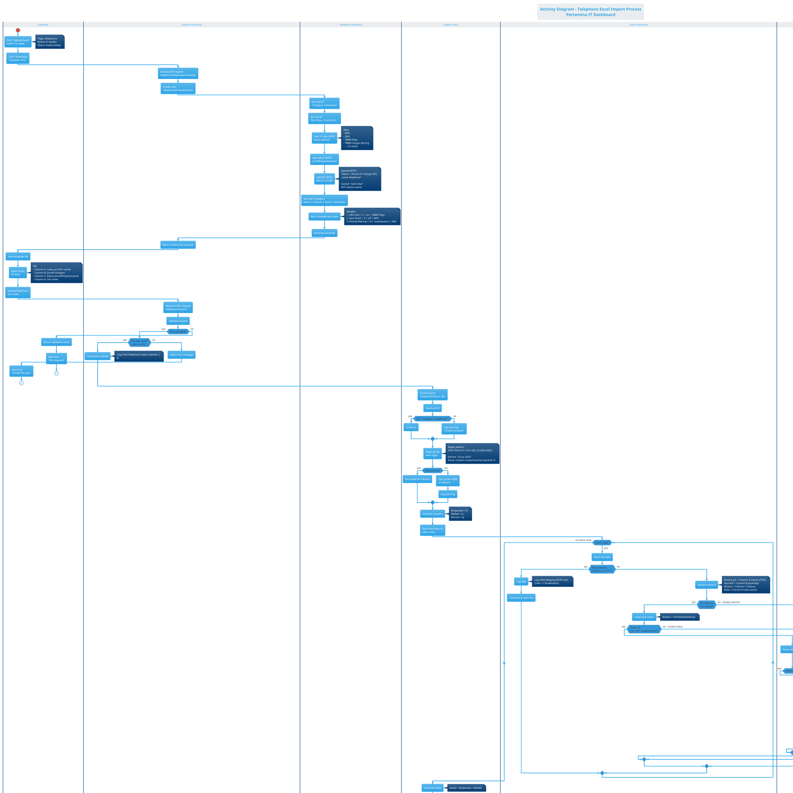

```plantuml
@startuml Telephone_UseCase
!theme cerulean
skinparam packageStyle rectangle
skinparam actorBorderColor #2C3E50
skinparam usecaseBorderColor #3498DB

title Use Case Diagram - Telephone Module\nPertamina IT Dashboard

' Actors
actor Admin as admin
actor Operator as operator
actor System as system

' Package: Data Management
package "Data Management" {
  usecase "View Telephone\nList" as UC1
  usecase "Create Telephone\nRecord" as UC2
  usecase "Update Telephone\nRecord" as UC3
  usecase "Delete Telephone\nRecord" as UC4
  usecase "Search Telephone" as UC5
}

' Package: Import/Export
package "Import/Export" {
  usecase "Download Excel\nTemplate" as UC6
  usecase "Upload Excel\nImport" as UC7
  usecase "Validate Excel\nFile" as UC8
  usecase "Parse Excel\nRows" as UC9
  usecase "Export Telephone\nData" as UC10
}

' Package: Filtering & Reporting
package "Filtering & Reporting" {
  usecase "Filter by Site" as UC11
  usecase "Filter by Status" as UC12
  usecase "Filter by Date\nRange" as UC13
  usecase "View Statistics" as UC14
}

' Package: System Operations
package "System Operations" {
  usecase "Lookup Site\n(LIKE query)" as UC15
  usecase "Validate Status\nEnum" as UC16
  usecase "Set Audit Trail\n(created_by/updated_by)" as UC17
  usecase "Log Import\nActivity" as UC18
  usecase "Generate Flash\nMessage" as UC19
}

' Relationships - Admin
admin --> UC1
admin --> UC2
admin --> UC3
admin --> UC4
admin --> UC5
admin --> UC6
admin --> UC7
admin --> UC10
admin --> UC11
admin --> UC12
admin --> UC13
admin --> UC14

' Relationships - Operator
operator --> UC1
operator --> UC2
operator --> UC3
operator --> UC5
operator --> UC6
operator --> UC7
operator --> UC11
operator --> UC12
operator --> UC13

' Relationships - System
system --> UC8
system --> UC9
system --> UC15
system --> UC16
system --> UC17
system --> UC18
system --> UC19

' Include relationships
UC2 ..> UC17 : <<include>>
UC3 ..> UC17 : <<include>>
UC4 ..> UC17 : <<include>>

UC6 ..> UC15 : <<include>>

UC7 ..> UC8 : <<include>>
UC7 ..> UC9 : <<include>>
UC7 ..> UC18 : <<include>>

UC9 ..> UC15 : <<include>>
UC9 ..> UC16 : <<include>>

UC2 ..> UC15 : <<include>>
UC3 ..> UC15 : <<include>>

' Extend relationships
UC7 ..> UC19 : <<extend>>
UC2 ..> UC19 : <<extend>>
UC3 ..> UC19 : <<extend>>
UC4 ..> UC19 : <<extend>>

' Notes
note right of UC2
  Unique Feature:
  nama_pic = Person In Charge
  NOT device name!
  
  Example: "John Doe"
  NOT "Telephone Panasonic"
end note

note right of UC7
  Template Excel:
  - Cell A3: Category header
  - Cell A6: End Time (date)
  - Row 9: Headers
  - Row 10+: Data
  - Blue NOTE: PIC explanation
end note

note bottom of UC9
  Validation Rules:
  1. Skip NOTE rows
  2. Column A = nama_pic (required)
  3. Column B = jumlah (integer)
  4. Column C = status (on/off/maintenance)
  5. Column D = site (lookup with LIKE)
  6. Date from A6 with regex
end note

note right of UC15
  Site Lookup:
  Site::where('lokasi', 'LIKE', 
  '%' . $site . '%')->first()
  
  Flexible matching:
  "Plaju" matches "TBBM Plaju"
  "MPS" matches "MPS"
end note

note left of UC17
  Audit Trail:
  created_by = Auth::id()
  updated_by = Auth::id()
  
  Auto-filled on create/update
end note

@enduml
```

```plantuml
@startuml Telephone_Sequence_Import
!theme cerulean
autonumber

title Sequence Diagram - Telephone Excel Import\nPertamina IT Dashboard

actor Operator
participant "Browser/UI\n(React/Inertia)" as UI
participant "TelephoneController" as Controller
participant "TelephoneImport\n(Import Class)" as Importer
participant "Site Model" as SiteModel
participant "Telephone Model" as TelModel
database "Database\n(SQLite/MySQL)" as DB
participant "Logger\n(Log::info/error)" as Logger
participant "Flash\n(Session)" as Flash

== Download Template Flow ==

Operator -> UI: Click "Download Template"
activate UI

UI -> Controller: GET /telephone/download-template
activate Controller

Controller -> Controller: new TelephoneTemplateExport()
activate Controller

note over Controller
  Template structure:
  - A3: "Category: Telephone..."
  - A6: "End Time: 25 Jul 2025..."
  - NOTE sections (15 sites, status, PIC)
  - Row 9: Headers
  - Row 10-12: Sample data
end note

Controller -> Controller: Generate Excel with styling
note right
  Special:
  - Blue colored NOTE for PIC
  - Sample: "John Doe", "Jane Smith"
  - 15 sites listed
end note

Controller --> UI: Download Excel file
deactivate Controller
deactivate Controller

UI --> Operator: Save template file
deactivate UI

Operator -> Operator: Open Excel, fill data
note right
  Fill columns:
  A: nama_pic (e.g., "Ahmad Rahman")
  B: jumlah (e.g., 5)
  C: status (e.g., "on")
  D: site (e.g., "TBBM Plaju")
end note

== Upload Import Flow ==

Operator -> UI: Upload filled Excel via modal
activate UI

UI -> Controller: POST /telephone/import\n(FormData: file)
activate Controller

Controller -> Controller: Validate request
note right
  Validation rules:
  - file: required
  - file: mimes:xlsx,xls
  - file: max:10240 (10MB)
end note

alt File validation failed
  Controller -> Flash: flash('error', 'Invalid file')
  activate Flash
  Flash --> Controller: OK
  deactivate Flash
  
  Controller --> UI: Redirect back with errors
  deactivate Controller
  
  UI --> Operator: Show error message
  deactivate UI
  
  Operator -> UI: Fix and retry
  note right: Return to upload step
end

Controller -> Logger: Log::info('Import started')
activate Logger
Logger -> Logger: Write to storage/logs/laravel.log
note right
  Log entry:
  [timestamp] local.INFO: Telephone import started
  {"user_id": 1, "filename": "telephone_data.xlsx"}
end note
Logger --> Controller: Logged
deactivate Logger

Controller -> Importer: Excel::import(new TelephoneImport, file)
activate Importer

Importer -> Importer: Read cell A3 (category header)
note right
  Expected: "Category: Telephone..."
  Validates correct template
end note

Importer -> Importer: Read cell A6 with regex
note right
  Regex: /End Time:\s*(.+?)\s+\d{1,2}:\d{2}:\d{2}/
  Extract: "25 Jul 2025"
  Parse: Carbon::createFromFormat('d M Y', $match)
end note

Importer -> Logger: Log::info('Date parsed', date)
activate Logger
Logger --> Importer: Logged
deactivate Logger

Importer -> Importer: Initialize counters\n($imported=0, $failed=0, $errors=[])

== Loop Through Rows ==

loop For each row starting from Row 10
  Importer -> Importer: Read row data (A, B, C, D)
  
  alt Row is NOTE row (contains "NOTE" or "****")
    Importer -> Logger: Log::info('Skipping NOTE row')
    activate Logger
    Logger --> Importer: Logged
    deactivate Logger
    
    note right: Continue to next iteration
  else Row is data row
    Importer -> Importer: Extract columns
    note right
      $nama_pic = $row[0]  // Column A
      $jumlah = $row[1]    // Column B
      $status = $row[2]    // Column C
      $site = $row[3]      // Column D
    end note
    
    alt Any column empty
      Importer -> Logger: Log::error('Empty columns', row)
      activate Logger
      Logger --> Importer: Logged
      deactivate Logger
      
      Importer -> Importer: Increment $failed
      Importer -> Importer: Add error to $errors array
      
    else All columns filled
      Importer -> Importer: $status = strtolower($status)
      
      alt Status not in ['on','off','maintenance']
        Importer -> Logger: Log::error('Invalid status', status)
        activate Logger
        Logger --> Importer: Logged
        deactivate Logger
        
        Importer -> Importer: Increment $failed
        
      else Status valid
        Importer -> SiteModel: Site::where('lokasi', 'LIKE',\n'%' . $site . '%')->first()
        activate SiteModel
        
        note over SiteModel
          LIKE query for flexible matching:
          Input: "Plaju" → Match: "TBBM Plaju"
          Input: "MPS" → Match: "MPS"
          Input: "Gerong" → Match: "TBBM Sungai Gerong"
        end note
        
        SiteModel -> DB: SELECT * FROM sites\nWHERE lokasi LIKE '%Plaju%'\nLIMIT 1
        activate DB
        DB --> SiteModel: Return site record or null
        deactivate DB
        
        SiteModel --> Importer: Return Site object or null
        deactivate SiteModel
        
        alt Site not found
          Importer -> Logger: Log::error('Site not found', site_name)
          activate Logger
          Logger --> Importer: Logged
          deactivate Logger
          
          Importer -> Importer: Increment $failed
          Importer -> Importer: Add to $errors
          
        else Site found
          Importer -> TelModel: Telephone::create([...])
          activate TelModel
          
          note over TelModel
            Create with:
            - nama_pic: $nama_pic (PIC name!)
            - jumlah: $jumlah
            - status: $status (lowercase)
            - site_id: $site->id
            - tanggal_pencatatan: $date
            - created_by: Auth::id() (audit trail)
            - updated_by: Auth::id() (audit trail)
          end note
          
          TelModel -> DB: INSERT INTO telephone\nVALUES (...)
          activate DB
          
          alt Insert success
            DB --> TelModel: Return created record with ID
            deactivate DB
            
            TelModel --> Importer: Return Telephone object
            deactivate TelModel
            
            Importer -> Importer: Increment $imported
            
            Importer -> Logger: Log::info('Row imported successfully')
            activate Logger
            note right
              Log entry:
              {"row": 10, "nama_pic": "John Doe",
               "site": "TBBM Plaju", "status": "on"}
            end note
            Logger --> Importer: Logged
            deactivate Logger
            
          else Insert failed (DB error)
            DB --> TelModel: Throw exception
            deactivate DB
            TelModel --> Importer: Throw exception
            deactivate TelModel
            
            Importer -> Logger: Log::error('Insert failed', exception)
            activate Logger
            Logger --> Importer: Logged
            deactivate Logger
            
            Importer -> Importer: Increment $failed
            Importer -> Importer: Add to $errors
          end
        end
      end
    end
  end
end

== Summary & Response ==

Importer -> Importer: Calculate totals\n($total = $imported + $failed)

Importer -> Logger: Log::info('Import completed', stats)
activate Logger
note right
  Log entry:
  {"total_rows": 15, "imported": 12,
   "failed": 3, "user_id": 1}
end note
Logger --> Importer: Logged
deactivate Logger

Importer --> Controller: Return void\n(Excel::import doesn't return)
deactivate Importer

Controller -> Controller: Read counters/logs\nfor statistics

alt Has failures ($failed > 0)
  Controller -> Flash: session()->flash('warning',\n"Berhasil {$imported}, Gagal {$failed}")
  activate Flash
  Flash --> Controller: OK
  deactivate Flash
  
else All success ($failed == 0)
  Controller -> Flash: session()->flash('success',\n"Berhasil mengimport {$imported} data")
  activate Flash
  Flash --> Controller: OK
  deactivate Flash
end

Controller --> UI: Redirect to route('telephone.index')
deactivate Controller

UI -> UI: Inertia.js detects redirect
UI -> UI: Auto-reload page data

UI -> Controller: GET /telephone (refresh data)
activate Controller
Controller -> TelModel: Telephone::with('site')->get()
activate TelModel
TelModel -> DB: SELECT * FROM telephone\nJOIN sites...
activate DB
DB --> TelModel: Return updated records
deactivate DB
TelModel --> Controller: Collection
deactivate TelModel
Controller --> UI: Inertia response with data
deactivate Controller

UI -> UI: Update table with new records
UI -> UI: Show flash message

UI --> Operator: Display updated list\nand success/warning message
deactivate UI

note over Operator
  Message examples:
  
  Success:
  "Berhasil mengimport 15 data
  dari 15 baris."
  
  Warning:
  "Berhasil mengimport 12 data.
  Gagal mengimport 3 data.
  Silakan cek format Excel."
end note

@enduml
```

# UML DIAGRAMS - TELEPHONE MODULE

> **Module**: Telephone  
> **Priority**: HIGH  
> **Complexity**: MEDIUM  
> **Status**: ✅ Ready to Render  
> **Unique Feature**: `nama_pic` (Person In Charge) - NOT device name!

---

## 📋 MODULE INFORMATION

**Description**: Manajemen telepon kantor dengan fitur bulk import via Excel. **UNIQUE**: Menggunakan kolom `nama_pic` untuk menyimpan nama Person In Charge (orang yang bertanggung jawab), bukan nama perangkat.

**Key Features**:
- CRUD telephone records
- Excel Import/Export dengan template khusus
- Site lookup (15 lokasi Pertamina)
- Status management (On/Off/Maintenance)
- Audit trail (created_by, updated_by)

**Actors**:
- **Admin**: Full CRUD, import, export, delete
- **Operator**: View, create, update (no delete)
- **System**: File storage, validation, site lookup

**Business Rules**:
- `nama_pic` wajib diisi dengan nama orang (contoh: "John Doe", "Ahmad Rahman")
- Status: on/off/maintenance (case-insensitive)
- Site lookup menggunakan LIKE query untuk fleksibilitas (contoh: "Plaju" match "TBBM Plaju")
- Excel template memiliki NOTE berwarna biru yang menjelaskan PIC
- Skip rows yang mengandung "NOTE" atau "****"
- Tanggal diambil dari cell A6 menggunakan regex parsing
- Auto-fill audit fields (created_by, updated_by) dari Auth::id()

**Tech Stack**:
- Controller: `TelephoneController` (`app/Http/Controllers/TelephoneController.php`)
- Model: `App\Models\Telephone`
- Import Class: `App\Imports\TelephoneImport`
- Export Class: `App\Exports\TelephoneTemplateExport`
- View: `resources/js/pages/telephone/index.jsx` (React + Inertia)
- Excel Library: Maatwebsite Excel 3.1

**Database Schema**:
```sql
TABLE: telephone
- id: bigint (PK, auto_increment)
- nama_pic: string(255) - Person In Charge name
- jumlah: integer - Quantity of telephones
- status: enum('on','off','maintenance')
- site_id: bigint (FK → sites.id)
- tanggal_pencatatan: date - Recording date
- created_by: bigint (FK → users.id, nullable)
- updated_by: bigint (FK → users.id, nullable)
- created_at: timestamp
- updated_at: timestamp

INDEXES:
- PRIMARY KEY (id)
- FOREIGN KEY (site_id) REFERENCES sites(id)
- FOREIGN KEY (created_by) REFERENCES users(id)
- FOREIGN KEY (updated_by) REFERENCES users(id)
```

**Sample Data**:
```
nama_pic: "John Doe", "Jane Smith", "Ahmad Rahman"
jumlah: 5, 3, 8
status: "on", "off", "maintenance"
site: "TBBM Plaju", "MPS", "SM5"
```

---

---

# 🎯 USE CASE DIAGRAM - TELEPHONE

## Deskripsi
Diagram ini menggambarkan interaksi user (Admin & Operator) dengan sistem manajemen Telephone, termasuk CRUD operations dan Excel Import/Export functionality dengan focus pada unique feature `nama_pic`.

---

## PlantUML Code



---

## Penjelasan Diagram

**Actors**:
1. **Admin**: Full access - CRUD, import, export, delete, all filters
2. **Operator**: Limited access - View, create, update, import, basic filters (no delete)
3. **System**: Background operations - validation, site lookup, audit trail, logging

**Use Cases - Data Management** (5 use cases):
- **View Telephone List**: Display all telephone records dengan pagination
- **Create Telephone Record**: Form input dengan nama_pic (PIC name), jumlah, status, site
- **Update Telephone Record**: Edit existing record
- **Delete Telephone Record**: Admin only - soft/hard delete
- **Search Telephone**: Search by nama_pic atau site

**Use Cases - Import/Export** (5 use cases):
- **Download Excel Template**: Generate template dengan NOTE berwarna biru tentang PIC, 15 sites, status options
- **Upload Excel Import**: Bulk import dari Excel file
- **Validate Excel File**: Check file type (.xlsx/.xls), structure, headers
- **Parse Excel Rows**: Loop rows, extract data, skip NOTE rows
- **Export Telephone Data**: Export ke Excel/CSV

**Use Cases - Filtering & Reporting** (4 use cases):
- **Filter by Site**: Dropdown 15 lokasi Pertamina
- **Filter by Status**: On/Off/Maintenance
- **Filter by Date Range**: Custom date range
- **View Statistics**: Count by site, status distribution

**Use Cases - System Operations** (5 use cases):
- **Lookup Site**: LIKE query untuk flexible matching
- **Validate Status Enum**: Check status in ['on','off','maintenance']
- **Set Audit Trail**: Auto-fill created_by/updated_by
- **Log Import Activity**: Log::info untuk tracking
- **Generate Flash Message**: Success/warning/error messages

**Include Relationships**:
- Create/Update/Delete **include** Set Audit Trail (always executed)
- Upload Excel **include** Validate File, Parse Rows, Log Activity
- Parse Rows **include** Lookup Site, Validate Status
- Download Template **include** Lookup Site (untuk list sites)

**Extend Relationships**:
- Create/Update/Delete/Upload **extend** Generate Flash Message (conditional)

**Unique Characteristics**:
- `nama_pic` adalah nama orang (PIC), bukan nama perangkat
- Template Excel punya NOTE khusus berwarna biru
- Site lookup fleksibel dengan LIKE query
- Audit trail otomatis

---

## Validation Checklist

- [x] 3 Actors (Admin, Operator, System) dengan peran jelas
- [x] 19 Use cases covering all functionality
- [x] 4 Packages untuk grouping (Data, Import/Export, Filtering, System)
- [x] Include relationships untuk mandatory operations
- [x] Extend relationships untuk conditional operations
- [x] Notes menjelaskan unique features (nama_pic, site lookup, audit)
- [x] Template Excel structure dijelaskan
- [x] Validation rules lengkap

---

---

# 🔄 ACTIVITY DIAGRAM - TELEPHONE EXCEL IMPORT

## Deskripsi
Diagram ini menggambarkan alur aktivitas lengkap proses Excel Import untuk Telephone, dari download template hingga summary report. Fokus pada validation, site lookup dengan LIKE query, dan handling nama_pic (unique feature).

---

## PlantUML Code



---

## Penjelasan Diagram

**Swimlanes**:
1. **Operator**: User actions (download, fill, upload)
2. **System/Controller**: Request handling dan response
3. **Template Generator**: Excel template creation (TelephoneTemplateExport)
4. **Import Class**: Parsing dan validation (TelephoneImport)
5. **Site Lookup**: Database query untuk site matching
6. **Database Insert**: Telephone record creation
7. **Loop Processing**: Iterasi setiap row

**Primary Flow - Download Template**:
1. Operator klik "Download Template"
2. System create TelephoneTemplateExport
3. Set header cells (A3, A6)
4. Add 15 sites NOTE (blue)
5. Add status NOTE (on/off/maintenance)
6. **Add PIC NOTE (BLUE COLOR)** - unique feature!
7. Set headers Row 9
8. Add 3 sample data (John Doe, Jane Smith, Ahmad Rahman)
9. Generate Excel
10. Operator download dan fill

**Primary Flow - Upload Import**:
1. Operator upload Excel
2. Controller validate file type
3. Import class read A3 (category validation)
4. Import class read A6 with regex (date extraction)
5. Loop dari Row 10
6. **For each row**:
   - Skip if NOTE row
   - Extract columns (A=nama_pic, B=jumlah, C=status, D=site)
   - Validate all columns not empty
   - Lowercase status
   - Validate status enum
   - **Site lookup dengan LIKE** (flexible matching)
   - If site found → create Telephone record
   - Set audit fields (created_by, updated_by)
   - Increment counters
   - Log activity
7. Generate summary
8. Flash message (success/warning based on failures)
9. Redirect dan auto-refresh

**Decision Points**:
- File uploaded?
- File type valid?
- A3 header valid?
- Date parsed?
- More rows?
- Is NOTE row?
- All columns not empty?
- Status valid?
- Site found?
- Insert success?
- Any failures?

**Error Branches**:
- Invalid file type → abort
- Empty columns → skip row, increment failed
- Invalid status → skip row, log error
- Site not found → skip row, log error
- Insert failure → skip row, log error

**Logging Points**:
- Import started
- Template header validation
- Date parsing warning
- Skip NOTE row
- Row imported successfully
- Each error type with details
- Import summary

**Unique Features Highlighted**:
- **nama_pic** (PIC name) in sample data
- **Blue NOTE** untuk PIC explanation
- **LIKE query** untuk site lookup
- **Audit trail** auto-fill
- **Regex parsing** untuk date extraction

---

## Validation Checklist

- [x] Start dan End states clear
- [x] 7 Swimlanes untuk separation of concerns
- [x] Download template flow lengkap
- [x] Upload import flow lengkap
- [x] Loop processing untuk rows
- [x] 11 Decision nodes untuk validation
- [x] Error branches dengan recovery/logging
- [x] Notes menjelaskan business logic
- [x] Unique features (nama_pic, site LIKE, audit) highlighted
- [x] Sample data (John Doe, etc.) shown
- [x] Logging points marked

---

---

# 🔀 SEQUENCE DIAGRAM - TELEPHONE EXCEL IMPORT

## Deskripsi
Diagram ini menggambarkan interaksi detail antar komponen sistem saat Operator melakukan Excel Import untuk Telephone. Fokus pada message passing, validation, site lookup dengan LIKE query, dan audit trail untuk nama_pic.

---

## PlantUML Code



---

## Penjelasan Diagram

**Participants** (10 komponen):
1. **Operator**: End user melakukan import
2. **Browser/UI**: React/Inertia frontend
3. **TelephoneController**: Laravel controller
4. **TelephoneImport**: Import class (Maatwebsite Excel)
5. **Site Model**: Eloquent model untuk site lookup
6. **Telephone Model**: Eloquent model untuk insert
7. **Database**: SQLite/MySQL storage
8. **Logger**: Log::info/error untuk audit trail
9. **Flash**: Session flash messages
10. **Auth**: Authentication (implicit, via Auth::id())

**Flow Structure**:
- **Download Template** (Steps 1-9): Generate dan download template
- **Upload Import** (Steps 10-20): Validate file dan start import
- **Loop Through Rows** (Steps 21-60): Parse, validate, insert each row
- **Summary & Response** (Steps 61-75): Calculate stats, flash message, redirect

**Download Template Flow** (Steps 1-9):
1. Operator click button
2. UI send GET request
3. Controller create TelephoneTemplateExport
4. Generate Excel dengan structure khusus (A3, A6, NOTEs)
5. **Blue NOTE untuk PIC** explanation
6. Sample data: "John Doe", "Jane Smith", "Ahmad Rahman"
7. Return download response
8. Operator save dan fill template

**Upload Import Flow** (Steps 10-20):
1. Operator upload filled Excel
2. UI POST dengan FormData
3. Controller validate file (required, mimes, max size)
4. **Alt block**: If validation failed → flash error → retry
5. Log import started dengan user_id dan filename
6. Call Excel::import dengan TelephoneImport class
7. Read A3 (category validation)
8. Read A6 dengan regex (date extraction)
9. Initialize counters

**Loop Processing** (Steps 21-60):
- **For each row** starting Row 10
- **Nested alt blocks** untuk validation:
  1. **Is NOTE row?** → Skip dengan logging
  2. **Columns empty?** → Increment failed, log error
  3. **Status invalid?** → Increment failed, log error
  4. **Site lookup** dengan LIKE query:
     - SiteModel query database
     - Flexible matching ("Plaju" → "TBBM Plaju")
  5. **Site not found?** → Increment failed, log error
  6. **Site found** → Create Telephone:
     - Map columns (A=nama_pic, B=jumlah, C=status, D=site_id)
     - **Set audit fields** (created_by, updated_by)
     - Insert to database
  7. **Insert success?** → Increment imported, log success
  8. **Insert failed?** → Increment failed, log error

**Summary Flow** (Steps 61-75):
1. Calculate totals ($imported + $failed)
2. Log import completed summary
3. **Alt block**: Has failures?
   - Yes → Flash warning message
   - No → Flash success message
4. Redirect to telephone.index
5. Inertia auto-reload page
6. Fetch updated data (Telephone::with('site')->get())
7. Display flash message
8. Show updated table

**Error Handling**:
- File validation error (step 15) → alt block dengan retry
- Empty columns (step 30) → skip row, log
- Invalid status (step 35) → skip row, log
- Site not found (step 47) → skip row, log
- Insert failure (step 56) → skip row, log

**Activation Boxes**:
- Show processing time untuk setiap participant
- Nested activations untuk create operations
- Database queries highlighted

**Return Messages** (dashed arrows):
- Site lookup result (found/null)
- Database insert result (success/exception)
- Log confirmation
- Flash message confirmation

**Key Features Highlighted**:
1. **nama_pic** (PIC name) in create data
2. **Blue NOTE** in template
3. **LIKE query** untuk site lookup dengan contoh
4. **Audit trail** (created_by, updated_by)
5. **Regex parsing** untuk date extraction
6. **Logging** di setiap critical step
7. **Flash messages** conditional (success/warning)

**Notes Included**:
- Template structure (A3, A6, rows)
- Sample data examples
- Validation rules
- LIKE query matching examples
- Log entry formats
- Flash message examples

---

## Validation Checklist

- [x] 10 Participants lengkap (User, UI, Controller, Import, Models, DB, Logger, Flash)
- [x] Autonumbering untuk 75+ steps
- [x] Activation boxes menunjukkan processing time
- [x] Download template flow (steps 1-9)
- [x] Upload import flow (steps 10-20)
- [x] Loop processing dengan nested validations (steps 21-60)
- [x] Summary & response flow (steps 61-75)
- [x] Alt blocks untuk error handling (5 scenarios)
- [x] Site LIKE query dijelaskan dengan contoh
- [x] Audit trail (created_by/updated_by) ditampilkan
- [x] Logging points di setiap critical step
- [x] Flash messages conditional
- [x] Return messages (dashed arrows)
- [x] Notes menjelaskan business logic
- [x] Unique features (nama_pic, blue NOTE) highlighted

---

---

# 📊 RENDERING INSTRUCTIONS

## Online Tools (Recommended for Quick Preview)

### PlantUML Online Editor
1. **URL**: https://www.plantuml.com/plantuml/uml/
2. **Steps**:
   - Copy salah satu PlantUML code di atas
   - Paste ke text area
   - Click "Submit" atau tekan Ctrl+Enter
   - Diagram akan muncul di kanan
3. **Download**:
   - Right-click diagram → Save image as...
   - Format: PNG (default), SVG (scalable), PDF (print)

### PlantText (Alternative)
1. **URL**: https://www.planttext.com/
2. **Steps**:
   - Paste PlantUML code
   - Auto-render di preview panel
   - Click "Download" untuk save

---

## VSCode Extension (Recommended for Development)

### Setup
```bash
# Install extension
# Search: "PlantUML" by jebbs in VSCode marketplace
# Or install via command line:
code --install-extension jebbs.plantuml
```

### Prerequisites
- **Java**: Download from https://www.java.com/
- **Graphviz** (optional, for better layouts):
  ```bash
  # Windows (PowerShell as Admin)
  choco install graphviz
  
  # Or download installer
  # https://graphviz.org/download/
  ```

### Usage
1. Create file: `telephone-usecase.puml`
2. Paste PlantUML code
3. **Preview**: Press `Alt+D` (Windows/Linux) or `Option+D` (Mac)
4. **Export**:
   - Right-click diagram in preview
   - Select "Export Current Diagram"
   - Choose format (PNG/SVG/PDF)
   - Select output directory

### Keyboard Shortcuts
- `Alt+D`: Preview diagram
- `Ctrl+Shift+P` → "PlantUML: Export Current Diagram"
- `Ctrl+Shift+P` → "PlantUML: Export Workspace Diagrams"

---

## IntelliJ IDEA / WebStorm

### Setup
1. **Menu**: File → Settings → Plugins
2. **Search**: "PlantUML Integration"
3. **Install** dan restart IDE

### Usage
1. Create `.puml` file
2. Paste code
3. **Auto-preview** di panel kanan
4. **Export**: Right-click diagram → Export → Format

---

## Command Line (For Batch Processing)

### Install PlantUML CLI

**Windows (Chocolatey)**:
```powershell
choco install plantuml
```

**macOS (Homebrew)**:
```bash
brew install plantuml
```

**Linux (apt)**:
```bash
sudo apt install plantuml
```

**Manual (All platforms)**:
```bash
# Download plantuml.jar
wget https://sourceforge.net/projects/plantuml/files/plantuml.jar/download -O plantuml.jar

# Run with Java
java -jar plantuml.jar diagram.puml
```

### Generate Diagrams

**Single file**:
```bash
# Generate PNG (default)
plantuml telephone-usecase.puml

# Generate SVG (scalable)
plantuml -tsvg telephone-usecase.puml

# Generate PDF
plantuml -tpdf telephone-usecase.puml
```

**Multiple files**:
```bash
# All .puml files in current directory
plantuml *.puml

# With specific output directory
plantuml -o ./output *.puml

# SVG format for all files
plantuml -tsvg *.puml
```

**Watch mode** (auto-regenerate on save):
```bash
plantuml -tsvg -o ./output -failfast2 -nbthread auto -realtimemonitoring telephone-*.puml
```

---

## Customization & Styling

### Change Theme

Available themes:
```plantuml
!theme cerulean       ' Blue (current)
!theme amiga          ' Retro
!theme plain          ' Minimal
!theme sketchy        ' Hand-drawn
!theme sketchy-outline
!theme toy            ' Colorful
!theme materia        ' Material Design
!theme mars           ' Red
!theme carbon         ' Dark
```

### Custom Colors

```plantuml
skinparam backgroundColor #FFFFFF
skinparam actorBorderColor #2C3E50
skinparam actorBackgroundColor #3498DB
skinparam usecaseBorderColor #27AE60
skinparam usecaseBackgroundColor #E8F8F5
skinparam packageBorderColor #8E44AD
skinparam packageBackgroundColor #F4ECF7
skinparam noteBorderColor #E67E22
skinparam noteBackgroundColor #FEF5E7
```

### Font Customization

```plantuml
skinparam defaultFontName Arial
skinparam defaultFontSize 14
skinparam titleFontSize 18
skinparam titleFontStyle bold
skinparam actorFontSize 12
skinparam usecaseFontSize 12
skinparam noteFontSize 10
```

### Layout Direction

```plantuml
' Use Case - horizontal layout
left to right direction

' Activity/Sequence - vertical (default)
top to bottom direction
```

---

## Export Format Recommendations

### For Documentation (Laporan KP)
- **Format**: SVG or PDF
- **Why**: Scalable, professional, sharp text
- **Command**: `plantuml -tsvg telephone-*.puml`
- **Embed**: Insert ke Word/LaTeX

### For Presentation (PowerPoint)
- **Format**: PNG with high DPI
- **Why**: Compatible, easy to resize
- **Command**: `plantuml -tpng telephone-*.puml`
- **Settings**: Export at 300 DPI minimum

### For Web/GitHub README
- **Format**: SVG or PNG
- **Why**: SVG scalable, PNG universal
- **Embed**: 
  ```markdown
  
  ```

### For Print (A4/A3)
- **Format**: PDF or high-res PNG
- **Why**: Print quality
- **Command**: `plantuml -tpdf telephone-*.puml`
- **Paper**: A4 portrait or A3 landscape

---

## File Organization

### Recommended Structure
```
docs/
├── diagrams/
│   ├── telephone/
│   │   ├── telephone-usecase.puml
│   │   ├── telephone-usecase.svg
│   │   ├── telephone-activity.puml
│   │   ├── telephone-activity.svg
│   │   ├── telephone-sequence.puml
│   │   └── telephone-sequence.svg
│   ├── dashboard/
│   ├── hpboc/
│   └── ...
└── DIAGRAMS_TELEPHONE.md (this file)
```

### Batch Export Script

**PowerShell**:
```powershell
# Create output directories
New-Item -ItemType Directory -Force -Path "docs/diagrams/telephone"

# Export all telephone diagrams
plantuml -tsvg -o "docs/diagrams/telephone" docs/telephone-*.puml
```

**Bash**:
```bash
# Create output directory
mkdir -p docs/diagrams/telephone

# Export all telephone diagrams
plantuml -tsvg -o docs/diagrams/telephone docs/telephone-*.puml
```

---

# ✅ COMPLETION CHECKLIST

Telephone Module Diagrams:
- [x] Use Case Diagram created (19 use cases, 3 actors)
- [x] Activity Diagram created (Excel import flow, 7 swimlanes)
- [x] Sequence Diagram created (75+ steps, download + import)
- [ ] Diagrams rendered successfully (your task)
- [ ] Diagrams exported to PNG/SVG/PDF
- [ ] Diagrams reviewed for accuracy
- [ ] Diagrams integrated to documentation

---

# 🎯 NEXT STEPS

## Immediate Actions

1. **Render Diagrams Now**
   - Open https://www.plantuml.com/plantuml/uml/
   - Copy Use Case code → Render → Download SVG
   - Copy Activity code → Render → Download SVG
   - Copy Sequence code → Render → Download SVG

2. **Verify Diagrams**
   - Check all actors present
   - Verify business rules correct
   - Confirm unique features shown (nama_pic, site LIKE)
   - Validate audit trail included

3. **Save & Organize**
   - Save PlantUML source (`.puml` files)
   - Save rendered images (`.svg` or `.png`)
   - Create `docs/diagrams/telephone/` folder
   - Commit to Git repository

## Continue with Other Modules

**Recommended Next**:
- **HPBOC** (similar pattern, status: Baik/Rusak/Maintenance)
- **Radio HT** (very similar to HPBOC)
- **PC Device** (unique: NO SITE, alokasi MPS/SM5)

**Or pick from**:
- Dashboard (already done!)
- Network Device (monitoring: up/down/availability)
- CCTV (complex: readiness report)
- Ticket (different domain: IT support)

---

# 📝 NOTES & TIPS

## Key Differences - Telephone vs Other Modules

| Feature | Telephone | Other Modules |
|---------|-----------|---------------|
| Name Column | `nama_pic` (PIC name) | `nama_perangkat` (device name) |
| Sample Data | "John Doe", "Jane Smith" | "HP LaserJet", "Cisco Router" |
| Template NOTE | Blue color, PIC explanation | Standard status/site notes |
| Status Values | on/off/maintenance | Varies (baik/rusak, online/offline) |
| Site Relation | Yes (site_id FK) | Some yes, PC Device no |

## PlantUML Tips

- Use `!theme cerulean` for modern blue theme
- Add `left to right direction` for wide diagrams
- Use `autonumber` for sequence diagrams
- Use `note right/left/top/bottom` for explanations
- Use `alt/else/end` for conditional flows
- Use `loop/end` for iterations
- Use `activate/deactivate` for lifelines

## Common Issues

**Issue**: Diagram too wide
- **Fix**: Change to `top to bottom direction`
- **Fix**: Split into multiple diagrams

**Issue**: Text overlapping
- **Fix**: Increase `skinparam defaultFontSize`
- **Fix**: Use shorter labels

**Issue**: Arrow crossing
- **Fix**: Reorder participants
- **Fix**: Use `hidden` arrows for spacing

---

**Status**: ✅ Telephone diagrams ready to render!

**File created**: `docs/DIAGRAMS_TELEPHONE.md`  
**Date**: October 31, 2025  
**Module**: Telephone (2 of 8 modules)  
**Previous**: Dashboard ✅  
**Next**: HPBOC (recommended) or user choice
